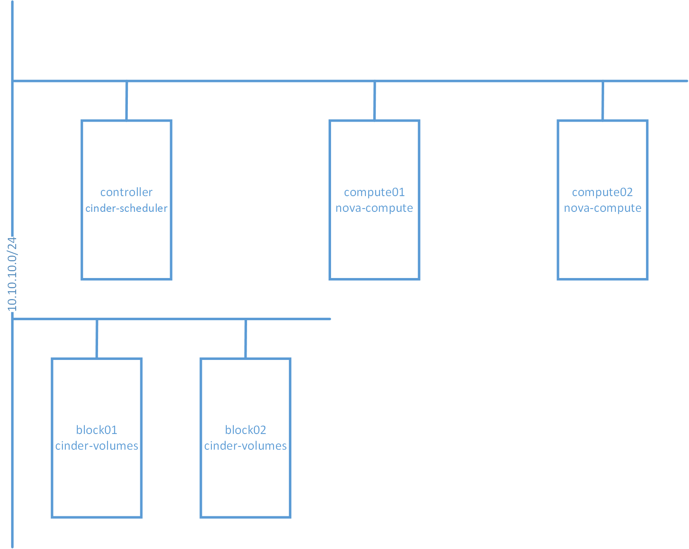
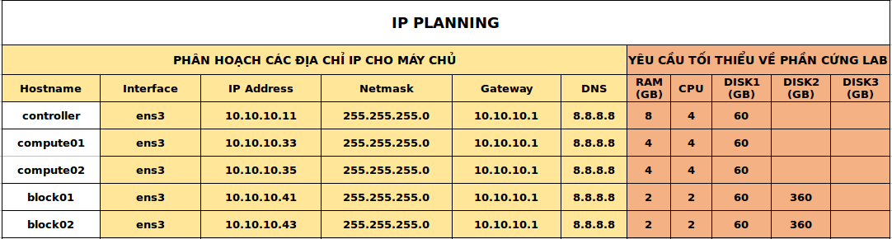

# Cấu hình live-migrate trong Openstack

# Mục lục

- [1. Mô hình thực hiện](#model)
- [2. Cách cấu hình](#config)
- [3. Kiểm tra kết quả](#result)

# Nội dung
- ### <a name="model">1. Mô hình thực hiện</a>
    - Mô hình thực hiện có thể được miêu tả như hình sau:
    
        
        
        và các node có địa chỉ IP như sau:
        
        
        
    - Các câu lệnh được thực hiện với người dùng root.
    - Hệ điều hành sử dụng trên các node là: Ubuntu 16.04
    - Hệ thống đã được cài đặt Openstack. Trên 2 node `block01` và `block02` cung cấp storage backend là `lvm`
    - Trong Openstack có volume type với property là `volume_backend_name=lvm`
    
- ### <a name="config">2. Cách cấu hình</a>

    - Việc cấu hình sẽ được thực hiện trên 2 node `compute01` và `compute02` là giống nhau.
    - Đầu tiên, ta sẽ cấu hình cho KVM-libvirt bằng việc chỉnh sửa nội dung file `/etc/nova/nova.conf` như sau:
    
            server_listen = 0.0.0.0
        
        giá trị của `state_path` trong `[DEFAULT]` nếu có phải giống nhau trên cả 2 node để đảm bảo cho giá trị của `instances_path` giống nhau với nội dung là `/var/lib/nova/instances`. Như vậy, ta có thể cấu hình như sau:
        
            [DEFAULT]
            ...
            state_path = /var/lib/nova
            
        hoặc:
        
            instances_path = /var/lib/nova/instances
            
        tiếp theo, là cấp quyền execute/search bit cho path `instances`:
        
            chmod o+x /var/lib/nova/instances
            
    - Tiếp theo, ta thực hiện cấu hình `livirtd` bằng cách thực hiện như sau:
        sửa nội dung file `/etc/libvirt/libvirtd.conf`:
        
            ...
            listen_tls = 0
            listen_tcp = 1
            tcp_port = "16509"
            listen_addr = "0.0.0.0"
            unix_sock_group = "libvirtd"
            unix_sock_ro_perms = "0777"
            unix_sock_rw_perms = "0770"
            auth_unix_ro = "none"
            auth_unix_rw = "none"
            auth_tcp = "none"
            
        sửa nội dung file `/etc/default/libvirtd`:
        
            start_libvirtd = "yes"
            libvirtd_opts = "-l -d"
            
    - Cuối cùng, ta khởi động lại services:
    
            service nova-compute restart
            service libvirtd restart
            
- ### <a name="result">3. Kiểm tra kết quả</a>
    - Thực hiện tạo một volume image mới:
    
            openstack volume create --size 20 --image cirros --type sdb-lvm sdb-lvm_cirros_volume_20G
            
        trong đó:
        - `cirros`: tên một image
        - `sdb-lvm`: tên volume type có property là `volume_backend_name=lvm`
        
    - Thực hiện tạo một server mới:
    
            openstack server create --flavor m1.small --volume sdb-lvm_cirros_volume_20G --network gateway_net gateway_net_sdb-lvm_cirros_instances
            
    - Thực hiện migrate:
        SSH vào server vừa tạo và thực hiện ping ra ngoài. Sau đó, ta sử dụng câu lệnh sau:
        
            openstack server migrate --live hostname gateway_net_sdb-lvm_cirros_instances
            
        trong đó:
        - `hostname` là tên host cần migrate instance tới.
