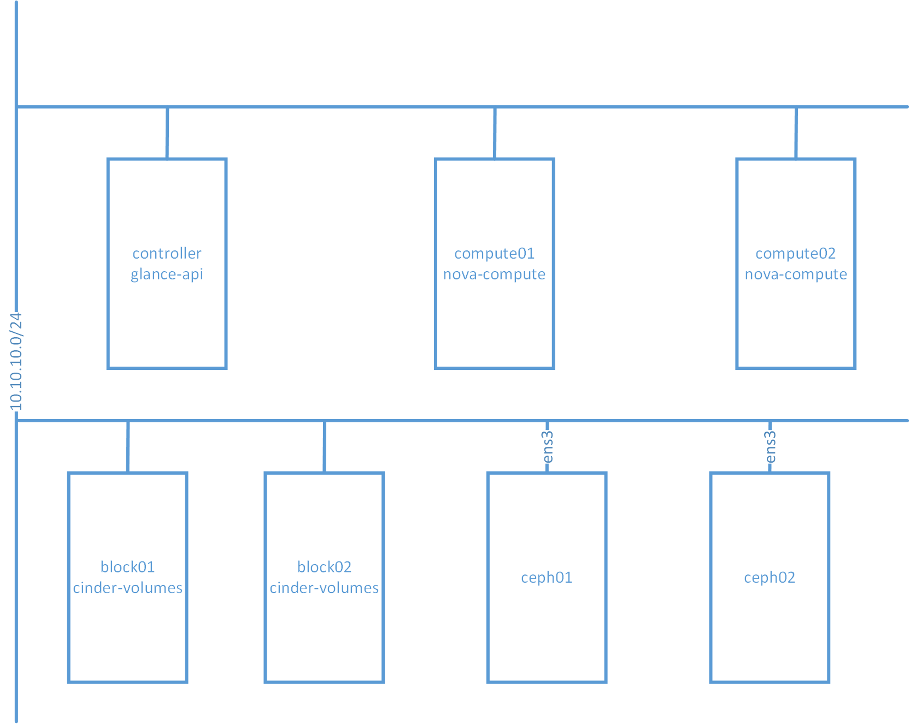
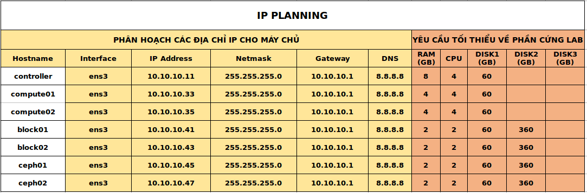

# Sử dụng CEPH trong Openstack

# Mục lục
- [1. Mô hình cài đặt và các yêu cầu](#about)
- [2. Cài đặt CEPH](#setting_ceph)
- [3. Sử dụng CEPH với Openstack]
    - [3.1 CEPH với Glance](#glance)
    - [3.2 CEPH với Cinder](#cinder)
    - [3.3 CEPH với Nova](#compute)

# Nội dung

- ### <a name="about">1. Mô hình cài đặt và các yêu cầu</a>
    - Việc cài đặt được tiến hành theo mô hình như sau:

        

    - Yêu cầu của các node bao gồm:
        - Sử dụng hệ điều hành: Ubuntu 16.04
        - Các node: controller, compute01, compute02, block01, block02 là các node được sử dụng trong Openstack.
            - block01, block02: cung cấp cinder-volume service.
        - Các node có địa chỉ IP như sau:

            

        - Các câu lệnh được thực hiện với người dùng root.
        - Có thể sử dụng SSH trên tất cả các node theo hostname.

- ### <a name="setting_ceph">2. Cài đăt CEHP</a>
    - Trước tiên, ta cần cài đặt chronyc trên cả hai node `ceph01` và `ceph02`. Vì mục đích cuối cùng là sử dụng trong hệ thống Openstack, nên ta sẽ thực hiện như sau:
        - Câu lệnh sau được thực hiện trên cả 2 node:

                apt install -y chrony

            sau khi cài đặt xong, ta thực hiện chỉnh sửa file cấu hình `/etc/chrony/chrony.conf` để thêm nội dung sau vào file:

                server controller iburst
                # pool 2.debian.pool.ntp.org offline iburst

        - Trên các node `ceph01` và `ceph02`. Lần lượt ta tạo ra user `ceph-deploy` và cấp quyền cho user:

                useradd -d /home/ceph-deploy -m ceph-deploy
                passwd ceph-deploy

                echo "ceph-deploy ALL = (root) NOPASSWD:ALL" | sudo tee /etc/sudoers.d/ceph-deploy
                sudo chmod 0440 /etc/sudoers.d/ceph-deploy

    - Việc cài đặt CEPH được thực hiện trên cả hai node: `ceph01` và `ceph02`.
    - Để cài đặt CEPH, ta sử dụng các lệnh sau lần lượt trên 2 node cài đặt CEPH:

            wget -q -O- 'https://download.ceph.com/keys/release.asc' | sudo apt-key add -

            echo deb https://download.ceph.com/debian-luminous/ $(lsb_release -sc) main | sudo tee /etc/apt/sources.list.d/ceph.list

            apt update

            apt install ceph-deploy

    - Cấu hình iptables mở port cho ceph daemon (chạy câu lệnh trên cả 2 node `ceph01` và `ceph02`):

            iptables -A INPUT -i ens3 -p tcp -s 10.0.0.0/24 --dport 6789 -j ACCEPT

            iptables-save

    - Tạo key SSH để ceph-deploy sử dụng SSH tới các node cài CEPH. Trên node `ceph01`, ta chạy câu lệnh sau:

            su ceph-deploy

            ssh-keygen

            Generating public/private key pair.
            Enter file in which to save the key (/ceph-admin/.ssh/id_rsa):
            Enter passphrase (empty for no passphrase):
            Enter same passphrase again:
            Your identification has been saved in /ceph-admin/.ssh/id_rsa.
            Your public key has been saved in /ceph-admin/.ssh/id_rsa.pub.

        Copy key tới nodes cài đặt CEPH:

            ssh-copy-id ceph-deploy@ceph01
            ssh-copy-id ceph-deploy@ceph02

        Để tiến hành cài đặt CEPH, ta chỉ cần chạy các câu lệnh sau trên node `ceph01`:

            cd
            mkdir my-cluster
            cd my-cluster

        Tạo ra cluster CEPH:

            ceph-deploy new ceph01 ceph02

        sau khi chạy câu lệnh trên, tại thư mục `my-cluster` có chứa các file sau:

            ceph-deploy-ceph.log, ceph.conf, ceph.mon.keyring

    - Sửa file `ceph.conf` để thêm nội dung sau:

            [global]
            ...
            public network = 10.10.10.0/24
            cluster network = 10.10.10.0/24
            mon_allow_pool_delete = true

    - Install CEPH packages:

            ceph-deploy install ceph01 ceph02

    - Triển khai initial monitors và lấy ra các keys:

            ceph-deploy mon create-initial

        câu lệnh trên sẽ tạo ra các file như sau:

        - ceph.client.admin.keyring
        - ceph.bootstrap-mgr.keyring
        - ceph.bootstrap-osd.keyring
        - ceph.bootstrap-mds.keyring
        - ceph.bootstrap-rgw.keyring
        - ceph.bootstrap-rbd.keyring

    - Copy file cấu hình tới các node trong cluster CEPH:

           ceph-deploy admin ceph01
           ceph-deploy admin ceph02

    - Triển khai một `manager daemon`:

            ceph-deploy mgr create ceph01 ceph02

    - Thêm OSDs trên các node cài CEPH:

            ceph-deploy osd create --data /dev/sdb ceph01
            ceph-deploy osd create --data /dev/sdb ceph02

       trong đó:

       - `/dev/sdb` là path của disk ta muốn CEPH sử dụng.

    - Sử dụng câu lệnh sau đây nếu như muốn sử dụng CephFS:

            ceph-deploy mds create ceph01
            ceph-deploy mds create ceph02

    - Kiểm tra kết quả cài đặt CEPH:

                sudo ceph -s

        kết quả sẽ hiển thị tương tự như sau:

             cluster:
                id:     84d78bca-f5e8-449f-aa03-f5d9c9ce3a8b
                health: HEALTH_OK

              services:
                mon: 2 daemons, quorum ceph01,ceph02
                mgr: ceph01(active), standbys: ceph02
                osd: 2 osds: 2 up, 2 in

              data:
                pools:   0 pools, 0 pgs
                objects: 0  objects, 0 B
                usage:   2.0 GiB used, 38 GiB / 40 GiB avail
                pgs:

- ### <a>3. Sử dụng CEPH với Openstack </a>
    - Đầu tiên, ta thực hiện tạo ra ceph pools `images`, `volumes`, `vms` lần lượt được sử dụng cho Glance, Cinder và Nova. Trên node `ceph01` ta sử dụng các câu lệnh sau:

           ceph osd pool create images 128
           ceph osd pool create backups 128
           ceph osd pool create vms 128

    - Tiếp theo, ta cài đặt CEPH trên các node trong Openstack với câu lệnh như sau:

           wget -q -O- 'https://download.ceph.com/keys/release.asc' | sudo apt-key add -
           echo deb https://download.ceph.com/debian-luminous/ $(lsb_release -sc) main | sudo tee /etc/apt/sources.list.d/ceph.list
           apt update
           apt-get install -y python-rbd ceph-common

    - Trên node `ceph01`, copy file cấu hình đến tất cả các node trong Openstack:

            ssh controller sudo tee /etc/ceph/ceph.conf </etc/ceph/ceph.conf
            ssh compute01 sudo tee /etc/ceph/ceph.conf </etc/ceph/ceph.conf
            ssh compute02 sudo tee /etc/ceph/ceph.conf </etc/ceph/ceph.conf
            ssh block01 sudo tee /etc/ceph/ceph.conf </etc/ceph/ceph.conf
            ssh block02 sudo tee /etc/ceph/ceph.conf </etc/ceph/ceph.conf

        tạo user cho glance, nova và cinder phục vụ cho CEPH Client Authentication:

            ceph auth get-or-create client.glance mon 'profile rbd' osd 'profile rbd pool=images'
            ceph auth get-or-create client.cinder mon 'profile rbd' osd 'profile rbd pool=volumes, profile rbd pool=vms, profile rbd-read-only pool=images'
            ceph auth get-or-create client.nova mon 'allow r' osd 'allow class-read object_prefix rbd_children, allow rwx pool=vms, allow rx pool=images'

    - Thêm lần lượt keyrings client.glance, client.cinder, client.nova lần lượt tương ứng đến node cài đặt glance-api, cinder-volume và nova-compute service, sau đó cấp quyền truy cập:

            ceph auth get-or-create client.glance | ssh controller sudo tee /etc/ceph/ceph.client.glance.keyring
            ssh controller sudo chown glance:glance /etc/ceph/ceph.client.glance.keyring

            ceph auth get-or-create client.nova | ssh compute01 sudo tee /etc/ceph/ceph.client.nova.keyring
            ssh compute01 sudo chown nova:nova /etc/ceph/ceph.client.nova.keyring
            ceph auth get-or-create client.nova | ssh compute02 sudo tee /etc/ceph/ceph.client.nova.keyring
            ssh compute02 sudo chown nova:nova /etc/ceph/ceph.client.nova.keyring

            ceph auth get-or-create client.cinder | ssh block01 sudo tee /etc/ceph/ceph.client.cinder.keyring
            ssh block01 sudo chown cinder:cinder /etc/ceph/ceph.client.cinder.keyring
            ceph auth get-key client.nova | ssh compute01 tee /root/client.nova.key
            ceph auth get-or-create client.cinder | ssh block02 sudo tee /etc/ceph/ceph.client.cinder.keyring
            ssh block02 sudo chown cinder:cinder /etc/ceph/ceph.client.cinder.keyring
            ceph auth get-key client.nova | ssh compute02 tee /root/client.nova.key

            ceph auth get-or-create client.cinder | ssh compute01 sudo tee /etc/ceph/ceph.client.cinder.keyring
            ceph auth get-key client.cinder | ssh compute01 tee client.cinder.key
            ceph auth get-or-create client.cinder | ssh compute02 sudo tee /etc/ceph/ceph.client.cinder.keyring
            ceph auth get-key client.cinder | ssh compute02 tee client.cinder.key

    - #### <a name="glance">3.1 CEPH với Glance</a>
        Trên node controller, ta thực hiện sửa file `/etc/glance/glance-api.conf` như sau:

            [DEFAULT]
            ...
            show_image_direct_url = True
            enable_v2_api = true
            enable_v2_registry = true
            enable_v1_api = true
            enable_v1_registry = true

            [glance_store]
            ...
            stores = file, http, swift, cinder, rbd
            default_store = rbd
            rbd_store_pool = images
            rbd_store_user = glance
            rbd_store_ceph_conf = /etc/ceph/ceph.conf
            rbd_store_chunk_size = 8

        Lưu file lại và khởi động lại services:

            service glance-registry restart
            service glance-api restart

        Kiểm tra kết quả:

            openstack image create "cirros-ceph" \
            --file cirros-0.4.0-x86_64-disk.img \
            --disk-format qcow2 --container-format bare \
            --public

        trong đó: `cirros-0.4.0-x86_64-disk.img` là tên file của image. Kết quả:

            root@controller:~# openstack image list
            +--------------------------------------+-------------+--------+
            | ID                                   | Name        | Status |
            +--------------------------------------+-------------+--------+
            | 0872ea57-7e9a-4cd3-8558-57971ad4c3be | cirros      | active |
            | dab2c64f-aa79-4e2f-9764-fa6439647262 | cirros-ceph | active |
            +--------------------------------------+-------------+--------+

        và:

            root@controller:~# openstack image show dab2c64f-aa79-4e2f-9764-fa6439647262
            +------------------+---------------------------------------------------------------------------------------------------------------------------------------------------------------------------------------------------------------------------------------------------+
            | Field            | Value                                                                                                                                                                                                                                             |
            +------------------+---------------------------------------------------------------------------------------------------------------------------------------------------------------------------------------------------------------------------------------------------+
            | checksum         | 443b7623e27ecf03dc9e01ee93f67afe                                                                                                                                                                                                                  |
            | container_format | bare                                                                                                                                                                                                                                              |
            | created_at       | 2018-07-18T16:58:24Z                                                                                                                                                                                                                              |
            | disk_format      | qcow2                                                                                                                                                                                                                                             |
            | file             | /v2/images/dab2c64f-aa79-4e2f-9764-fa6439647262/file                                                                                                                                                                                              |
            | id               | dab2c64f-aa79-4e2f-9764-fa6439647262                                                                                                                                                                                                              |
            | min_disk         | 0                                                                                                                                                                                                                                                 |
            | Field            | Value                                                                                                                                                                                                                                             |
            +------------------+---------------------------------------------------------------------------------------------------------------------------------------------------------------------------------------------------------------------------------------------------+
            | checksum         | 443b7623e27ecf03dc9e01ee93f67afe                                                                                                                                                                                                                  |
            | container_format | bare                                                                                                                                                                                                                                              |
            | created_at       | 2018-07-18T16:58:24Z                                                                                                                                                                                                                              |
            | disk_format      | qcow2                                                                                                                                                                                                                                             |
            | file             | /v2/images/dab2c64f-aa79-4e2f-9764-fa6439647262/file                                                                                                                                                                                              |
            | id               | dab2c64f-aa79-4e2f-9764-fa6439647262                                                                                                                                                                                                              |
            | min_disk         | 0                                                                                                                                                                                                                                                 |
            | min_ram          | 0                                                                                                                                                                                                                                                 |
            | name             | cirros-ceph                                                                                                                                                                                                                                       |
            | owner            | 8f8dbdc4ac454e898e74c93fec4e547f                                                                                                                                                                                                                  |
            | properties       | direct_url='rbd://dea268aa-876d-4ef9-98e3-9efdeb3808e6/images/dab2c64f-aa79-4e2f-9764-fa6439647262/snap', locations='[{u'url': u'rbd://dea268aa-876d-4ef9-98e3-9efdeb3808e6/images/dab2c64f-aa79-4e2f-9764-fa6439647262/snap', u'metadata': {}}]' |
            | protected        | False                                                                                                                                                                                                                                             |
            | schema           | /v2/schemas/image                                                                                                                                                                                                                                 |
            | size             | 12716032                                                                                                                                                                                                                                          |
            | status           | active                                                                                                                                                                                                                                            |
            | tags             |                                                                                                                                                                                                                                                   |
            | updated_at       | 2018-07-18T16:58:31Z                                                                                                                                                                                                                              |
            | virtual_size     | None                                                                                                                                                                                                                                              |
            | visibility       | public                                                                                                                                                                                                                                            |
            +------------------+---------------------------------------------------------------------------------------------------------------------------------------------------------------------------------------------------------------------------------------------------+

        trên node `ceph01`, ta sử dụng câu lệnh:

            root@ceph01:~# rbd -p images ls
            dab2c64f-aa79-4e2f-9764-fa6439647262

    - #### <a name="cinder">3.2 CEPH với Cinder</a>
        Trên các node `block01` và `block02` lần lượt thực hiện sửa lội dung file `/etc/cinder/cinder.conf` như sau:

                [DEFAULT]
                ...
                enabled_backends = ceph
                glance_api_version = 2
                host = ceph
                ...
                [ceph]
                volume_driver = cinder.volume.drivers.rbd.RBDDriver
                volume_backend_name = ceph
                rbd_pool = volumes
                rbd_ceph_conf = /etc/ceph/ceph.conf
                rbd_flatten_volume_from_snapshot = false
                rbd_max_clone_depth = 5
                rbd_store_chunk_size = 4
                rados_connect_timeout = -1
                rbd_user = cinder
                rbd_secret_uuid = 54b2c9b0-ae74-4f62-8d72-62bab72302d9
                report_discard_supported = true

        lưu lại file, sau đó khởi động lại service:

                service cinder-volume restart

        Thực hiện kiểm tra kết quả như sau:
        trên node controller ta khởi động lại service:

            service cinder-scheduler restart

        tạo volume type ceph:

            openstack volume type create --property volume_backend_name ceph

        tạo volume mới:

            openstack volume create --size 20 --type ceph ceph_volume_20G

        kết quả:

            +---------------------+--------------------------------------+
            | Field               | Value                                |
            +---------------------+--------------------------------------+
            | attachments         | []                                   |
            | availability_zone   | nova                                 |
            | bootable            | false                                |
            | consistencygroup_id | None                                 |
            | created_at          | 2018-07-21T19:51:05.000000           |
            | description         | None                                 |
            | encrypted           | False                                |
            | id                  | ef4faef1-0041-4524-90fc-25e6ecddba6c |
            | migration_status    | None                                 |
            | multiattach         | False                                |
            | name                | ceph_volume_20G                      |
            | properties          |                                      |
            | replication_status  | None                                 |
            | size                | 20                                   |
            | snapshot_id         | None                                 |
            | source_volid        | None                                 |
            | status              | creating                             |
            | type                | ceph                                 |
            | updated_at          | None                                 |
            | user_id             | 2ca39318f1ad442986a9818e723f1d70     |
            +---------------------+--------------------------------------+

        trên node `ceph01`:

            root@ceph01:~# rbd -p volumes ls
            volume-ef4faef1-0041-4524-90fc-25e6ecddba6c

    - #### <a name="compute">3.1 CEPH với Nova</a>
        - Lần lượt thực hiện các bước sau trên cả hai node `compute01` và `compute02`.
        - Tạo secret `client.cinder` cho libvirt:

                cat > secret.xml <<EOF
                <secret ephemeral='no' private='no'>
                  <uuid>54b2c9b0-ae74-4f62-8d72-62bab72302d9</uuid>
                  <usage type='ceph'>
                    <name>client.cinder secret</name>
                  </usage>
                </secret>
                EOF
                sudo virsh secret-define --file secret.xml
                Secret 54b2c9b0-ae74-4f62-8d72-62bab72302d9 created
                sudo virsh secret-set-value --secret 54b2c9b0-ae74-4f62-8d72-62bab72302d9 --base64 $(cat client.cinder.key) && rm client.cinder.key secret.xml

        - Tạo secret `client.nova` cho libvirt:

                cat > secret.xml <<EOF
                <secret ephemeral='no' private='no'>
                  <uuid>0dafa203-2511-4c4b-bf05-2244d2cd4f87</uuid>
                  <usage type='ceph'>
                    <name>client.cinder secret</name>
                  </usage>
                </secret>
                EOF
                sudo virsh secret-define --file secret.xml
                Secret 0dafa203-2511-4c4b-bf05-2244d2cd4f87 created
                sudo virsh secret-set-value --secret 0dafa203-2511-4c4b-bf05-2244d2cd4f87 --base64 $(cat client.nova.key) && rm client.nova.key secret.xml

        - Sửa lại nội dung file cấu hình `/etc/nova/nova.conf` như sau:

                [DEFAULT]
                ...
                force_raw_images = true
                ...
                disk_cachemodes = writeback
                ...
                [libvirt]
                images_rbd_pool = vms
                ...
                images_type = rbd
                ...
                images_rbd_ceph_conf = /etc/ceph/ceph.conf
                ...
                rbd_secret_uuid = 0dafa203-2511-4c4b-bf05-2244d2cd4f87
                ...
                rbd_user = nova

        - Lưu lại file và khởi động lại service:

                sudo service nova-compute restart

            để kiểm tra kết quả, ta hãy tạo ra một instance và sử dụng image cirros-ceph, và volume ceph_volume_20G đã tạo ở trên.
