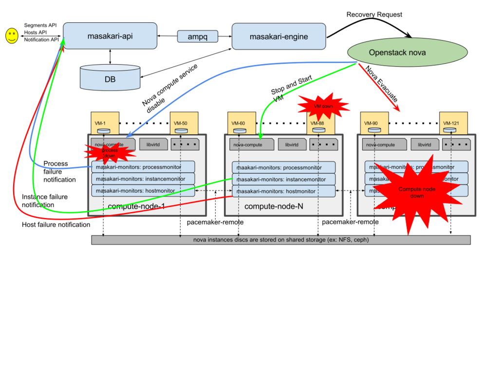

# Giới thiệu về Openstack Masakari

____

# Mục lục

- [1. Giới thiệu về Masakari](#about)
- [2. Tổng quan về các thành phần của Masakari](#overview)
- [3. Cách thức hoạt động của Masakari](#workflow)
- [Các nội dung khác](#content-others)

____

# <a name="content">Nội dung</a>

- ### <a name="about">1. Giới thiệu về Masakari</a>
	- Masakari là một project trong Openstack cung cấp Instances High Availability Service bằng việc tự động phục hồi failed instances. Hiện tại Masakari có thể làm việc với Virtual Machine(VM)s sử dụng nền tảng dựa trên KVM từ events bị lỗi chẳng hạn như `VM process down`, `nova-compute host failed`.
	- Masakari có thể cung cấp API cho phép ta quản lý và điều khiển các cơ chế phục hồi tự động của Masakari.

- ### <a name="overview">2. Tổng quan về các thành phần của Masakari</a>
	- Masakari bao gồm các thành phần chính sau:
		1. Masakari-API
			- Cung cấp API để các thành phần khác gọi đến và thực hiện tương tác với Masakari-database
		2. Masakari-Engine
			- Cung cấp các cơ chế phục hồi, xử lý khi có notifications gửi đến Masakari-API
		3. Masakari-CLI
			- Cung cấp giao diện CLI cho phép thực hiện thao tác quản lý các segments, nodes, and notifications được sử dụng trong Masakari.
		4. Masakari-Monitors
			- Cung cấp các công cụ giám sát về nova-compute node, process, instances trên các nova-compute (instance monitor và introspective instance monitor) thông qua việc monitor libvert để phát hiện VMs down, monitor manager process để phát hiện process down và monitor thông qua pacemaker-corosync để phát hiện nova-compute host down.
		5. Masakari-database.
			- Lưu giữ các thông tin về notifications, nova-compute host, process failed và các cơ chế phục hồi.

- ### <a name="workflow">3. Cách thức hoạt động của Masakari</a>
	- Cách thức hoạt động của các thành phần được sử dụng trong Masakari có thể được minh họa như hình ảnh dưới đây:

		

	- Nhìn vào hình trên, ta có thể thấy được như sau:
		- Masakari hoạt động thực sự khi và chỉ khi có failed events xảy ra trên các nova-compute host. Lúc này, sẽ có một notification được gửi đến masakari-api bao gồm các thông tin liên quan đến failed events bởi masakari-monitors.
		- Khi masakari-api nhận được notifications, nó sẽ thực hiện đọc nội dung chứa trong payload của notifications để insert vào database và thực hiện gọi gửi notifications tới masakari-engine thông qua message queue để có các hành động xử lý tương ứng với các loại notifications.
		- Masakari-engine thực hiện gọi tới endpoin của nova để thực hiện các hành động xử lý.
____

# <a name="content-others">Các nội dung khác</a>
