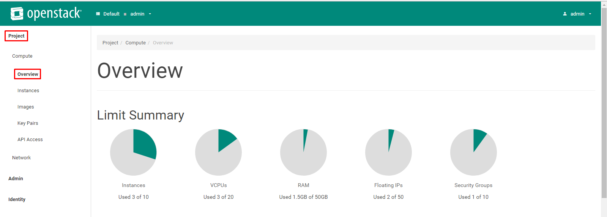
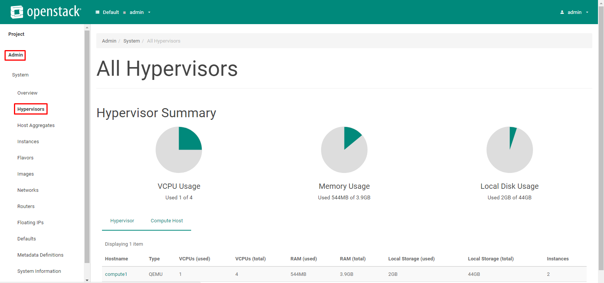

# Một số bài lab cơ bản với Nova

## 1. Managing Flavors
- Nova sử dụng một khái niệm là `flavor` dùng để định nghĩa ra các tài nguyên để cung cấp cho các Instance. Các tài nguyên như là vCPU, disk, ram, ...
- 1. Liệt kê ra tất cả các flavor có trong hệ thống. Thực hiện với quyền admin
  
  ```sh
  root@controller:~# . admin-openrc
  root@controller:~# openstack flavor list
  +--------------------------------------+-----------+-----+------+-----------+-------+-----------+
  | ID                                   | Name      | RAM | Disk | Ephemeral | VCPUs | Is Public |
  +--------------------------------------+-----------+-----+------+-----------+-------+-----------+
  | 8eac0d8d-9a2a-4dd8-86f6-8a5b53b90c85 | m1.medium | 512 |    5 |         0 |     1 | True      |
  +--------------------------------------+-----------+-----+------+-----------+-------+-----------+
  ```
  
  - Show thông tin chi tiết của flavor bằng lệnh sau

  ```sh
  root@controller:~# openstack flavor show m1.medium
  +----------------------------+--------------------------------------+
  | Field                      | Value                                |
  +----------------------------+--------------------------------------+
  | OS-FLV-DISABLED:disabled   | False                                |
  | OS-FLV-EXT-DATA:ephemeral  | 0                                    |
  | access_project_ids         | None                                 |
  | disk                       | 5                                    |
  | id                         | 8eac0d8d-9a2a-4dd8-86f6-8a5b53b90c85 |
  | name                       | m1.medium                            |
  | os-flavor-access:is_public | True                                 |
  | properties                 |                                      |
  | ram                        | 512                                  |
  | rxtx_factor                | 1.0                                  |
  | swap                       |                                      |
  | vcpus                      | 1                                    |
  +----------------------------+--------------------------------------+
  ```
  
- Mặc định, khi tạo một flavor thì flavor đó sẽ là public. Một flavor là public thì tất cả các project có thể nhìn thấy và sử dụng nó. Nếu flavor là private thì chỉ có trong project mà flavor được tạo ra mới nhìn thấy.
  - Tạo một flavor là public (có thể bỏ tham số `--public`)
  
  ```sh
  root@controller:~# openstack flavor create --id auto --ram 512 --disk 5 --vcpu 1 --public f_public.small
  +----------------------------+--------------------------------------+
  | Field                      | Value                                |
  +----------------------------+--------------------------------------+
  | OS-FLV-DISABLED:disabled   | False                                |
  | OS-FLV-EXT-DATA:ephemeral  | 0                                    |
  | disk                       | 5                                    |
  | id                         | 53173fab-739b-4087-8cd3-d6983de9e2a6 |
  | name                       | f_public.small                       |
  | os-flavor-access:is_public | True                                 |
  | properties                 |                                      |
  | ram                        | 512                                  |
  | rxtx_factor                | 1.0                                  |
  | swap                       |                                      |
  | vcpus                      | 1                                    |
  +----------------------------+--------------------------------------+
  ```
  
  - Tạo một flavor là private bằng cách thay thế tham số `--public` bằng `--private`
  
  ```sh
  root@controller:~# openstack flavor create --id auto --ram 512 --disk 5 --vcpu 1 --private f_private.small
  +----------------------------+--------------------------------------+
  | Field                      | Value                                |
  +----------------------------+--------------------------------------+
  | OS-FLV-DISABLED:disabled   | False                                |
  | OS-FLV-EXT-DATA:ephemeral  | 0                                    |
  | disk                       | 5                                    |
  | id                         | bb2a9287-0db3-4753-99bb-0d7459136ec4 |
  | name                       | f_private.small                      |
  | os-flavor-access:is_public | False                                |
  | properties                 |                                      |
  | ram                        | 512                                  |
  | rxtx_factor                | 1.0                                  |
  | swap                       |                                      |
  | vcpus                      | 1                                    |
  +----------------------------+--------------------------------------+
  ```
  
- List ra tất cả các flavor để xem kết quả vừa tạo.

  ```sh
  root@controller:~# openstack flavor list --all
  +--------------------------------------+-----------------+-----+------+-----------+-------+-----------+
  | ID                                   | Name            | RAM | Disk | Ephemeral | VCPUs | Is Public |
  +--------------------------------------+-----------------+-----+------+-----------+-------+-----------+
  | 53173fab-739b-4087-8cd3-d6983de9e2a6 | f_public.small  | 512 |    5 |         0 |     1 | True      |
  | 8eac0d8d-9a2a-4dd8-86f6-8a5b53b90c85 | m1.medium       | 512 |    5 |         0 |     1 | True      |
  | bb2a9287-0db3-4753-99bb-0d7459136ec4 | f_private.small | 512 |    5 |         0 |     1 | False     |
  +--------------------------------------+-----------------+-----+------+-----------+-------+-----------+
  ```
  
- 2. Xóa 1 flavor bằng lệnh sau

  ```sh
  openstack flavor delete <name or id của flavr>
  ```
  
## 2. Quản lý và truy cập đến VM bằng keypair.
- Trong SSH, có một kỹ thuật là sử dụng keypair để truy cập tới 1 host từ xa mà không cần mật khẩu.
- Chúng ta sẽ sử dụng kỹ thuật này để truy cập đến máy ảo mà không cần phải sử dụng mật khẩu.
- Keypair gồm 1 key public và 1 key private. Key public được lưu trong VM và key private được lưu ở người dùng. Sử dụng private key để xác thực người dùng thay vì mật khẩu.
- Tạo ra keypair và đưa public key vào openstack.

  ```sh
  ~# ssh-keygen -q -N ""
  Enter file in which to save the key (/root/.ssh/id_rsa): mykey
  ```
  
  - Sau khi thực hiện lệnh `ssh-keygen -q -N ""`, nhập tên file sẽ lưu cặp key này. Ở đây tên file là `mykey`
  - Liệt kê ra các file key mà hệ thống đã tạo
  
  ```sh
  ~# ls
  mykey  mykey.pub
  ```
  
  - gồm 2 key: `mykey` chứa private key và `mykey.pub` chứa public key.
  
- add public key vào openstack

  ```sh
  ~# openstack keypair create --public-key ~/mykey.pub mykey
  +-------------+-------------------------------------------------+
  | Field       | Value                                           |
  +-------------+-------------------------------------------------+
  | fingerprint | 26:3a:fb:a6:ea:67:d6:5d:7a:ad:94:69:29:6c:f9:4b |
  | name        | mykey                                           |
  | user_id     | 102f8ea368cd4451ad6fefeb15801177                |
  +-------------+-------------------------------------------------+
  ```

- List tất cả các key pair có trong hệ thống.

  ```sh
  ~# openstack keypair list
  +----------+-------------------------------------------------+
  | Name     | Fingerprint                                     |
  +----------+-------------------------------------------------+
  | Key-test | ad:02:b2:a0:2c:98:96:ee:9b:c4:d7:e0:68:30:69:a7 |
  | mykey    | 26:3a:fb:a6:ea:67:d6:5d:7a:ad:94:69:29:6c:f9:4b |
  +----------+-------------------------------------------------+
  ```
  
- Khi một máy ảo được tạo sử dụng `mykey` và đã được floating ip thì máy ảo có thể được truy cập với lệnh sau:

  ```sh
  ssh -i ~/mykey cirros@172.16.69.199
  ```
  
- Trong phần tiếp theo, mình sẽ hướng dẫn tạo máy ảo có sử dụng `mykey` vừa tạo và truy cập vào bằng private key.
  
  
## 3. Tạo, xóa, tắt máy ảo.
- Để tạo được máy ảo, trên hệ thống cần tối thiểu có `flavor, image, network`.
- Kiểm tra trên hệ thống đã có các thành phần trên hay chưa
  - List flavor.
  
  ```sh
  ~# openstack flavor list
  +--------------------------------------+----------------+-----+------+-----------+-------+-----------+
  | ID                                   | Name           | RAM | Disk | Ephemeral | VCPUs | Is Public |
  +--------------------------------------+----------------+-----+------+-----------+-------+-----------+
  | 8eac0d8d-9a2a-4dd8-86f6-8a5b53b90c85 | m1.medium      | 512 |    5 |         0 |     1 | True      |
  +--------------------------------------+----------------+-----+------+-----------+-------+-----------+
  ```
  
  - List image
  
  ```sh
  ~# openstack image list
  +--------------------------------------+--------+--------+
  | ID                                   | Name   | Status |
  +--------------------------------------+--------+--------+
  | 9b989c67-57a3-4f7d-88d0-d4137aa0a7fa | cirros | active |
  +--------------------------------------+--------+--------+
  ```
  
  - List network
  
  ```sh
  ~# openstack network list
  +--------------------------------------+--------------+--------------------------------------+
  | ID                                   | Name         | Subnets                              |
  +--------------------------------------+--------------+--------------------------------------+
  | 0629737b-fb13-4267-a3d5-1c65661cb8d3 | self-service | 7f30f02d-8588-4e9a-be18-db0951198ae2 |
  | 7b04523c-e1b5-4209-bf2e-6369fbb80b72 | provider     | e3fbb4c0-bb5d-4965-8ff2-98a67822a78e |
  +--------------------------------------+--------------+--------------------------------------+
  ```
  
  - Tạo máy ảo với network là `self-service`
  - List keypair
  
  ```sh
  ~# openstack keypair list
  +----------+-------------------------------------------------+
  | Name     | Fingerprint                                     |
  +----------+-------------------------------------------------+
  | Key-test | ad:02:b2:a0:2c:98:96:ee:9b:c4:d7:e0:68:30:69:a7 |
  | mykey    | 26:3a:fb:a6:ea:67:d6:5d:7a:ad:94:69:29:6c:f9:4b |
  +----------+-------------------------------------------------+
  ```
  - Chúng ta sẽ tạo máy ảo với `mykey`
- Tạo máy ảo với network là `self-service` và keypair là `mykey`

  ```sh
  openstack server create --flavor m1.medium --image cirros \
  --nic net-id=0629737b-fb13-4267-a3d5-1c65661cb8d3 --security-group default \
  --key-name mykey lab-keypair
  ```

- List ra tất cả các máy ảo hiện có trong hệ thống

  ```sh
  ~# openstack server list
  +--------------------------------------+-------------+---------+----------------------------+------------+
  | ID                                   | Name        | Status  | Networks                   | Image Name |
  +--------------------------------------+-------------+---------+----------------------------+------------+
  | 9b0497b7-87a6-425e-b93b-3fec1608f4f5 | lab-keypair | ACTIVE  | self-service=192.168.10.20 | cirros     |
  +--------------------------------------+-------------+---------+----------------------------+------------+
  ```
  
- Bây giờ chúng ta đã có thể truy cập đến console của máy ảo trên browser. Lấy đường dẫn đến máy ảo.

  ```sh
  ~# openstack console url show lab-keypair
  +-------+------------------------------------------------------------------------------------+
  | Field | Value                                                                              |
  +-------+------------------------------------------------------------------------------------+
  | type  | novnc                                                                              |
  | url   | http://172.16.69.190:6080/vnc_auto.html?token=57868aff-1cf1-4741-87e5-34facdf29318 |
  +-------+------------------------------------------------------------------------------------+
  ```
  
- Floating ip cho máy ảo.

  ```sh
  ~# openstack floating ip create provider
  +---------------------+--------------------------------------+
  | Field               | Value                                |
  +---------------------+--------------------------------------+
  | created_at          | 2017-06-21T04:49:55Z                 |
  | description         |                                      |
  | fixed_ip_address    | None                                 |
  | floating_ip_address | 172.16.69.196                        |
  | floating_network_id | 7b04523c-e1b5-4209-bf2e-6369fbb80b72 |
  | id                  | 73006c13-c77f-4095-813d-f4901234410a |
  | name                | None                                 |
  | port_id             | None                                 |
  | project_id          | b54646bf669746db8c62ec0410bd0528     |
  | revision_number     | 1                                    |
  | router_id           | None                                 |
  | status              | DOWN                                 |
  | updated_at          | 2017-06-21T04:49:55Z                 |
  +---------------------+--------------------------------------+
  ```
  
  - Dùng địa chỉ `172.16.69.196` để floating ip cho máy ảo
  - floating ip cho máy ảo bằng lệnh sau
  
  ```sh
  openstack server add floating ip lab-keypair 172.16.69.196
  ```
  
  - Kiểm tra lại địa chỉ ip của máy ảo
  
  ```sh
  ~# openstack server list
  +--------------------------------------+-------------+---------+-------------------------------------------+------------+
  | ID                                   | Name        | Status  | Networks                                  | Image Name |
  +--------------------------------------+-------------+---------+-------------------------------------------+------------+
  | 9b0497b7-87a6-425e-b93b-3fec1608f4f5 | lab-keypair | ACTIVE  | self-service=192.168.10.20, 172.16.69.196 | cirros     |
  +--------------------------------------+-------------+---------+-------------------------------------------+------------+

- Bây giờ chúng ta sẽ ssh vào máy ảo

  ```sh
  ~# ssh -i ~/mykey cirros@172.16.69.196
  The authenticity of host '172.16.69.196 (172.16.69.196)' can't be established.
  RSA key fingerprint is SHA256:TtVDgjmWduh1jM3xYLC4NK4GLxbxHs8Z9XQLkSFzV/A.
  Are you sure you want to continue connecting (yes/no)? yes
  Warning: Permanently added '172.16.69.196' (RSA) to the list of known hosts.
  $
  $
  $ ping -c 4 google.com
  PING google.com (216.58.200.14): 56 data bytes
  64 bytes from 216.58.200.14: seq=0 ttl=53 time=54.540 ms
  64 bytes from 216.58.200.14: seq=1 ttl=53 time=52.241 ms
  64 bytes from 216.58.200.14: seq=2 ttl=53 time=52.833 ms
  64 bytes from 216.58.200.14: seq=3 ttl=53 time=52.537 ms

  --- google.com ping statistics ---
  4 packets transmitted, 4 packets received, 0% packet loss
  round-trip min/avg/max = 52.241/53.037/54.540 ms
  ```
  
  - `-i` dùng để trỏ đến file chứa private key mà đã tạo ở phần trước.
  - Như vậy chúng ta đã đăng nhập được vào máy ảo bằng keypair và máy ảo đã có thể đi ra ngoài internet.
  
- Xong quá trình tạo máy ảo. 
- Show ra thông tin của máy ảo

  ```sh
  ~# openstack server show lab-keypair
  +-------------------------------------+----------------------------------------------------------+
  | Field                               | Value                                                    |
  +-------------------------------------+----------------------------------------------------------+
  | OS-DCF:diskConfig                   | MANUAL                                                   |
  | OS-EXT-AZ:availability_zone         | nova                                                     |
  | OS-EXT-SRV-ATTR:host                | compute1                                                 |
  | OS-EXT-SRV-ATTR:hypervisor_hostname | compute1                                                 |
  | OS-EXT-SRV-ATTR:instance_name       | instance-00000006                                        |
  | OS-EXT-STS:power_state              | Running                                                  |
  | OS-EXT-STS:task_state               | None                                                     |
  | OS-EXT-STS:vm_state                 | active                                                   |
  | OS-SRV-USG:launched_at              | 2017-06-21T04:41:34.000000                               |
  | OS-SRV-USG:terminated_at            | None                                                     |
  | accessIPv4                          |                                                          |
  | accessIPv6                          |                                                          |
  | addresses                           | self-service=192.168.10.20, 172.16.69.196                |
  | config_drive                        |                                                          |
  | created                             | 2017-06-21T04:40:48Z                                     |
  | flavor                              | m1.medium (8eac0d8d-9a2a-4dd8-86f6-8a5b53b90c85)         |
  | hostId                              | 280f7041c4aad37ba8c8b9af008d1a9aaae59699d702b6fb2afd4de8 |
  | id                                  | 9b0497b7-87a6-425e-b93b-3fec1608f4f5                     |
  | image                               | cirros (9b989c67-57a3-4f7d-88d0-d4137aa0a7fa)            |
  | key_name                            | mykey                                                    |
  | name                                | lab-keypair                                              |
  | progress                            | 0                                                        |
  | project_id                          | b54646bf669746db8c62ec0410bd0528                         |
  | properties                          |                                                          |
  | security_groups                     | name='default'                                           |
  | status                              | ACTIVE                                                   |
  | updated                             | 2017-06-21T04:41:34Z                                     |
  | user_id                             | 102f8ea368cd4451ad6fefeb15801177                         |
  | volumes_attached                    |                                                          |
  +-------------------------------------+----------------------------------------------------------+
  ```
  
- Để tắt máy ảo, dùng lệnh sau:

  ```sh
  openstack server stop <tên VM>
  ```
  
- Bật một máy ảo

  ```sh
  openstack server start <tên VM>
  ```

- Có thể `reboot` một VM đang chạy bằng lệnh

  ```sh
  openstack server reboot <tên VM>
  ```
  
- Xóa một VM

  ```sh
  openstack server delete <tên VM>
  ```
  
## 4. Quản lý snapshot
- Openstack có thể tạo snapshot một VM, thậm chí VM đó đang chạy.
- Snapshot không phải là một điểm khổi phục máy ảo mà snapshot là một image. 
- Bạn có thể tạo một máy ảo từ một snapshot.
- Cách tạo snapshot

  ```sh
  nova image-create <tên hoặc id VM> <tên snapshot>
  ```
  
- Sau khi tạo snapshot, sử dụng lệnh `openstack image list` hoặc `nova image-list` để xem các image. Ví dụ như sau

  ```sh
  ~# nova image-list
  /usr/lib/python2.7/dist-packages/novaclient/client.py:278: UserWarning: The 'tenant_id' argument is deprecated in Ocata and its use may result in errors in future releases. As 'project_id' is provided, the 'tenant_id' argument will be ignored.
    warnings.warn(msg)
  WARNING: Command image-list is deprecated and will be removed after Nova 15.0.0 is released. Use python-glanceclient or openstackclient instead
  +--------------------------------------+-------------------------+--------+--------------------------------------+
  | ID                                   | Name                    | Status | Server                               |
  +--------------------------------------+-------------------------+--------+--------------------------------------+
  | 9b989c67-57a3-4f7d-88d0-d4137aa0a7fa | cirros                  | ACTIVE |                                      |
  | 17e34b15-e57b-47d2-9341-984fde732121 | snapshot1               | ACTIVE | 9b0497b7-87a6-425e-b93b-3fec1608f4f5 |
  | 69a6f8d4-4043-442e-8540-bbdd0616ba11 | snapshot_Of_lab_keypair | ACTIVE | 9b0497b7-87a6-425e-b93b-3fec1608f4f5 |
  +--------------------------------------+-------------------------+--------+--------------------------------------+
  ```
  
- Tạo một máy ảo từ 1 snapshot

  ```sh
  openstack server create --flavor m1.medium --image snapshot1 \
  --nic net-id=0629737b-fb13-4267-a3d5-1c65661cb8d3 --security-group default \
  --key-name mykey vm-from-snapshot
  ```
  
  - lệnh tạo máy ảo hoàn toàn giống như đã tạo ở trước, tham số `-image` sẽ là file snapshot
  
## 5. Quản lý quotas
- Một quota giới hạn số lượng tài nguyên chỗ mỗi project.
- Số lượng tài nguyên cho mỗi project được định nghĩa trong section `[quota]` của file `/etc/nova/nova.conf`
- Xem thông tin quota

  ```sh
  ~# openstack quota show
  +----------------------+----------------------------------+
  | Field                | Value                            |
  +----------------------+----------------------------------+
  | cores                | 20                               |
  | fixed-ips            | -1                               |
  | floating-ips         | 50                               |
  | health_monitors      | None                             |
  | injected-file-size   | 10240                            |
  | injected-files       | 5                                |
  | injected-path-size   | 255                              |
  | instances            | 10                               |
  | key-pairs            | 100                              |
  | l7_policies          | None                             |
  | listeners            | None                             |
  | load_balancers       | None                             |
  | location             | None                             |
  | name                 | None                             |
  | networks             | 10                               |
  | pools                | None                             |
  | ports                | 50                               |
  | project              | b54646bf669746db8c62ec0410bd0528 |
  | project_id           | None                             |
  | properties           | 128                              |
  | ram                  | 51200                            |
  | rbac_policies        | 10                               |
  | routers              | 10                               |
  | secgroup-rules       | 100                              |
  | secgroups            | 10                               |
  | server-group-members | 10                               |
  | server-groups        | 10                               |
  | subnet_pools         | -1                               |
  | subnets              | 10                               |
  +----------------------+----------------------------------+
  ```
  
- Chúng ta có thể xem quota trên Horizon

  
  
## 5. Thống kê lại Nova
- Liệt kê các hypervisor có trong hệ thống

  ```sh
  ~# openstack hypervisor list
  +----+---------------------+-----------------+--------------+-------+
  | ID | Hypervisor Hostname | Hypervisor Type | Host IP      | State |
  +----+---------------------+-----------------+--------------+-------+
  |  1 | compute1            | QEMU            | 10.10.10.191 | up    |
  +----+---------------------+-----------------+--------------+-------+
  ```
  
- Liệt kê ra các VM có trên một node compute cụ thể

  ```sh
  ~# openstack server list --host compute1
  +--------------------------------------+-------------+---------+-------------------------------------------+------------+
  | ID                                   | Name        | Status  | Networks                                  | Image Name |
  +--------------------------------------+-------------+---------+-------------------------------------------+------------+
  | 9b0497b7-87a6-425e-b93b-3fec1608f4f5 | lab-keypair | SHUTOFF | self-service=192.168.10.20, 172.16.69.196 | cirros     |
  | 6b218881-b89c-400d-b9ce-1bd8e0415ba9 | vm_keypair  | SHUTOFF | self-service=192.168.10.11                | cirros     |
  +--------------------------------------+-------------+---------+-------------------------------------------+------------+
  ```
  
- Show thông tin chi tiết về một node compute

  ```sh
  ~# openstack hypervisor show compute1
  +----------------------+--------------------------------------------------------------------------------------------------------------------------+
  | Field                | Value                                                                                                                    |
  +----------------------+--------------------------------------------------------------------------------------------------------------------------+
  | aggregates           | []                                                                                                                       |
  | cpu_info             | {"vendor": "Intel", "model": "Penryn", "arch": "x86_64", "features": ["pge", "clflush", "sep", "syscall", "vme", "tsc",  |
  |                      | "xsave", "vmx", "cmov", "fpu", "pat", "lm", "msr", "nx", "fxsr", "sse4.1", "pae", "mmx", "cx8", "mce", "de", "mca",      |
  |                      | "pse", "pni", "apic", "sse", "lahf_lm", "sse2", "ss", "hypervisor", "ssse3", "cx16", "pse36", "mtrr", "x2apic"],         |
  |                      | "topology": {"cores": 1, "cells": 1, "threads": 1, "sockets": 4}}                                                        |
  | current_workload     | 0                                                                                                                        |
  | disk_available_least | 40                                                                                                                       |
  | free_disk_gb         | 34                                                                                                                       |
  | free_ram_mb          | 2415                                                                                                                     |
  | host_ip              | 10.10.10.191                                                                                                             |
  | host_time            | 15:47:13                                                                                                                 |
  | hypervisor_hostname  | compute1                                                                                                                 |
  | hypervisor_type      | QEMU                                                                                                                     |
  | hypervisor_version   | 2008000                                                                                                                  |
  | id                   | 1                                                                                                                        |
  | load_average         | 0.23, 0.06, 0.02                                                                                                         |
  | local_gb             | 44                                                                                                                       |
  | local_gb_used        | 2                                                                                                                        |
  | memory_mb            | 3951                                                                                                                     |
  | memory_mb_used       | 429                                                                                                                      |
  | running_vms          | 2                                                                                                                        |
  | service_host         | compute1                                                                                                                 |
  | service_id           | 6                                                                                                                        |
  | state                | up                                                                                                                       |
  | status               | enabled                                                                                                                  |
  | uptime               | 7:30                                                                                                                     |
  | users                | 1                                                                                                                        |
  | vcpus                | 4                                                                                                                        |
  | vcpus_used           | 0                                                                                                                        |
  +----------------------+--------------------------------------------------------------------------------------------------------------------------+
  ```
  
- Liệt kê ra tất cả các máy ảo đang chạy

  ```sh
  ~# openstack server list --status active
  +--------------------------------------+-------------+--------+-------------------------------------------+------------+
  | ID                                   | Name        | Status | Networks                                  | Image Name |
  +--------------------------------------+-------------+--------+-------------------------------------------+------------+
  | 9b0497b7-87a6-425e-b93b-3fec1608f4f5 | lab-keypair | ACTIVE | self-service=192.168.10.20, 172.16.69.196 | cirros     |
  +--------------------------------------+-------------+--------+-------------------------------------------+------------+
  ```
  
- Có thể xem thống kê các tài nguyên của hypervisor trên Horizon

  
  
