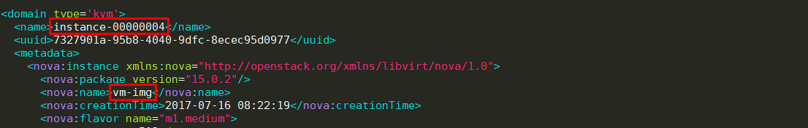
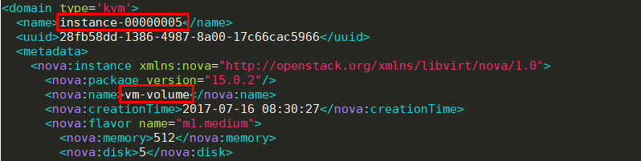
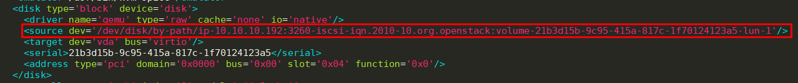

# Thực hiện launch instance
- Trong bài viết này mình xin đưa ra 2 cách launch instance:
  - Launch instance từ image
  - Launch instance từ volume.
- So sánh sự khác nhau giữa 2 cách này.

---

- Để có thể launch instance, trong hệ thống cần có các thành phần cần thiết. Chúng ta cần kiểm tra trước khi thực hiện launch instance.
- List flavors
  
  ```sh
  root@controller:~# openstack flavor list
  +--------------------------------------+-----------+-----+------+-----------+-------+-----------+
  | ID                                   | Name      | RAM | Disk | Ephemeral | VCPUs | Is Public |
  +--------------------------------------+-----------+-----+------+-----------+-------+-----------+
  | 88eb34a3-1e14-43d8-9ed0-461576d32115 | m1.medium | 512 |    5 |         0 |     1 | True      |
  +--------------------------------------+-----------+-----+------+-----------+-------+-----------+
  ```

- List images

  ```sh
  root@controller:~# openstack image list
  +--------------------------------------+---------------+--------+
  | ID                                   | Name          | Status |
  +--------------------------------------+---------------+--------+
  | 9b989c67-57a3-4f7d-88d0-d4137aa0a7fa | cirros        | active |
  +--------------------------------------+---------------+--------+
  ```
  
- List volumes

  ```sh
  root@controller:~# cinder list
  +--------------------------------------+-----------+------------------------+------+-------------+----------+--------------------------------------+
  | ID                                   | Status    | Name                   | Size | Volume Type | Bootable | Attached to                          |
  +--------------------------------------+-----------+------------------------+------+-------------+----------+--------------------------------------+
  | 21b3d15b-9c95-415a-817c-1f70124123a5 | available | volume-from-image      | 1    | -           | true     |                                      |
  | 2447909e-9ccd-4cdc-b2be-082b61ecf2e0 | available | vl-from-snapshot-empty | 1    | -           | false    |                                      |
  | 2cb93558-a907-4188-8f63-c0d7b86daf36 | in-use    | volume2                | 5    | -           | true     | bde4a1f4-b951-401e-ad09-c98af5eeb76a |
  | 4111ee2e-b2f6-4850-b212-50d5abd58930 | available | volume-from-volume2    | 1    | -           | true     |                                      |
  | 5d6328c7-a2bf-464b-8bb8-fc2a0a5305d2 | available | volume-from-volume     | 2    | -           | false    |                                      |
  | 80216bd2-0eba-42da-908d-6c5d40be748b | in-use    | volume-empty2          | 1    | -           | false    | 0af8fde5-f21a-40e0-89b6-8186f423025e |
  | adbf7ef4-7e5e-4dc3-a239-ca291c9ff555 | available | volume-empty           | 1    | -           | false    |                                      |
  | f1227040-0762-4c57-a3fd-65be01a69471 | available | vl-from-snapshot-img   | 1    | -           | true     |                                      |
  +--------------------------------------+-----------+------------------------+------+-------------+----------+--------------------------------------+
  ```
  
- List networks

  ```sh
  root@controller:~# openstack network list
  +--------------------------------------+--------------+--------------------------------------+
  | ID                                   | Name         | Subnets                              |
  +--------------------------------------+--------------+--------------------------------------+
  | 3bbfc1ad-1ebd-45cc-b47b-c492cacf375c | provider     | 1da3ccd5-a882-4f8f-b1fa-7f48c0da2db3 |
  | 86adab49-3c65-43e0-a617-1294b0e17fc2 | self-service | aa36d61b-84ab-46d2-a4d4-9e5fbf5a1762 |
  +--------------------------------------+--------------+--------------------------------------+
  ```
  
- List security group

  ```sh
  root@controller:~# openstack security group list
  +--------------------------------------+---------+------------------------+---------+
  | ID                                   | Name    | Description            | Project |
  +--------------------------------------+---------+------------------------+---------+
  | 403f8e42-28a8-48f8-8fd6-9f0c95b4bdd1 | default | Default security group |         |
  | d24b4580-7c0d-4755-af60-5b4053d03a27 | default | Default security group |         |
  | e5eec346-9ce7-4068-93fd-2a6379ee421c | default | Default security group |         |
  +--------------------------------------+---------+------------------------+---------+
  ```
  
  
## 1. Launch instance từ image và từ volume.
- Thực hiện launch instance từ image:

  ```sh
  openstack server create --flavor m1.medium --image cirros \
  --nic net-id=86adab49-3c65-43e0-a617-1294b0e17fc2 --security-group default \
  vm-img
  ```
  
- Launch instance từ volume

  ```sh
  openstack server create --flavor m1.medium --volume volume-from-image \
  --nic net-id=86adab49-3c65-43e0-a617-1294b0e17fc2 --security-group default \
  vm-volume
  ```

## 2. So sánh sự khác nhau giữa hai cách tạo trên
- Đăng nhập vào node `compute1` để kiểm tra thư mục chứa máy ảo.
- cd đến thư mục `/var/lib/nova/instances`
- Kiểm tra trong thư mục này có những gì

  ```sh
  root@compute1:/var/lib/nova/instances# ls -l
  total 24
  drwxr-xr-x 2 nova nova 4096 Jul 16 15:30 28fb58dd-1386-4987-8a00-17c66cac5966
  drwxr-xr-x 2 nova nova 4096 Jul 16 15:22 7327901a-95b8-4040-9dfc-8ecec95d0977
  drwxr-xr-x 2 nova nova 4096 Jul 14 00:59 _base
  -rw-r--r-- 1 nova nova   31 Jul 16 15:19 compute_nodes
  drwxr-xr-x 2 nova nova 4096 Jul 14 00:59 locks
  drwxr-xr-x 2 nova nova 4096 Jul 14 09:35 snapshots
  ```

- Ta có 2 thư mục đầu tiên chính là ID của các VM trong hệ thống.
  - Thư mục `28fb58dd-1386-4987-8a00-17c66cac5966` là thư mục của vm được tạo từ volume
  - Thư mục `7327901a-95b8-4040-9dfc-8ecec95d0977` là thư mục của vm được tạo từ image
- Kiểm tra xem trong 2 thư mục khác nhau những gì

  ```sh
  root@compute1:/var/lib/nova/instances# ls -l 28fb58dd-1386-4987-8a00-17c66cac5966/
  total 28
  -rw------- 1 root root 24849 Jul 16 15:37 console.log
  
  root@compute1:/var/lib/nova/instances# ls -l 7327901a-95b8-4040-9dfc-8ecec95d0977/
  total 1828
  -rw------- 1 root root   24849 Jul 16 15:36 console.log
  -rw-r--r-- 1 root root 1900544 Jul 16 15:36 disk
  -rw-r--r-- 1 nova nova      79 Jul 16 15:21 disk.info
  ```
  
- Trong thư mục của vm được tạo từ volume chỉ có 1 file console.
- Trong thư mục của vm được tạo từ image có 3 file: console.log, disk, disk.info
- Như vậy, VM được tạo từ volume sẽ không dùng disk trên node compute mà dùng volume do cinder cung cấp.
- Bây giờ chúng ta sẽ kiểm tra file xml định nghĩa các vm này. Xem sự khác nhau giữa chúng.

  ```sh
  root@compute1:~# ls -l /etc/libvirt/qemu
  total 20
  -rw------- 1 root root 4148 Jul 16 15:22 instance-00000004.xml
  -rw------- 1 root root 4200 Jul 16 15:30 instance-00000005.xml
  drwxr-xr-x 3 root root 4096 Jul 14 16:43 networks
  ```

- Các file xml định nghĩa vm nằm trong thư mục `/etc/libvirt/qemu/`
- xem file thông tin file `instance-00000004.xml` (mình chỉ lấy một số thông tin cần cho bài viết).

  
  
- Ta thấy đây là file của vm-img, vm được tạo từ image
- Xuống dưới xem thông tin disk của vm, ta thấy đường dẫn của disk chính là trỏ đến file `disk` nằm trong thư mục `/var/lib/nova/instances/7327901a-95b8-4040-9dfc-8ecec95d0977/`

  
  
- Kiểm tra file `instance-00000005.xml` xem có gì khác

  
  
- Đây là file định nghĩa vm tạo từ volume
- Thông tin về disk.

  
  
---

- Tóm tắt lại sự khác nhau giữa 2 cách tạo VM.
- Tạo VM bằng image sẽ sử dụng file disk ngay trên node compute1
- Tạo VM bằng volume sẽ sử dụng volume từ node cinder.