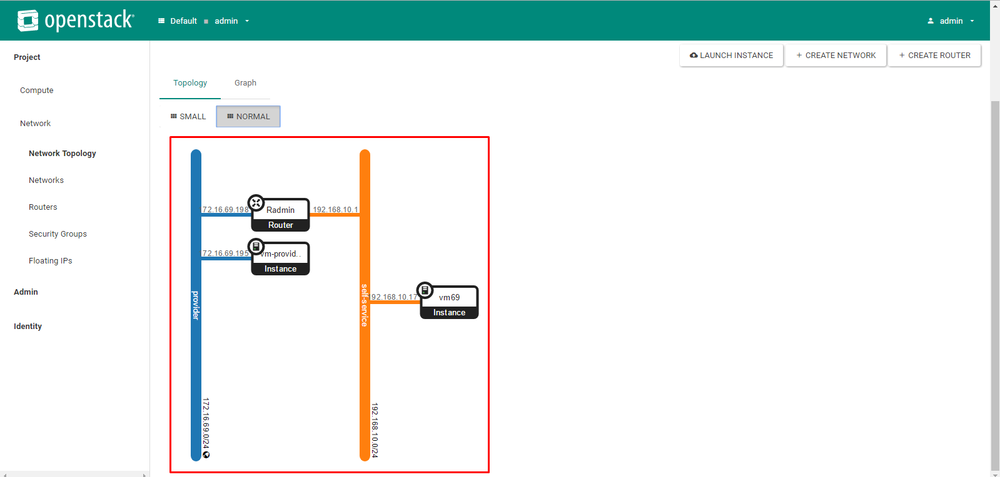

# Hướng dẫn sử dụng Dashboard tạo máy ảo.
Sau khi cài đặt thành công Openstack, chúng ta bắt đầu sử dụng dashboard để tạo máy ảo. Bạn có thể tham khảo cài đặt openstack [tại đây](./file_config_nova_in_controller.md) 


## Đăng nhập vào Dashboard

  
  
- Đăng nhập bằng tài khoản admin

### 1. Add thêm rule
- Click tab `Project => Network => Security groups => MANAGE RULES`

  
  
- Sau đó click `ADD RULE`

  
  
- Chọn `Other Protocol` để mở tất cả các rule từ bên ngoài vào VMs. Bạn có thể chọn `SSH` để đăng nhập vào máy ảo thông qua ssh (chọn `Other Protocol` thì cũng đã bao gồm cả ssh rồi).

  
  
### 2. Tạo network
- I. Tạo dải mạng cho phép máy ảo ra ngoài internet.

  - Click tab `Admin => Networks => CREATE NETWORK`
  
    
    
  - Điền các thông tin như hình sau rồi SUBMIT.
  
    
    
    ```sh
    Name: provider
    Project: admin
    Provider Network Typy: Flat
    Physical Network: provider
    Admin State: UP
    Shared: checked
    External Network: checked
    ```
  
  - Tạo sub-net.
    
    
    
  - Click vào tab `Subnets => CREATE SUBNET`
  
    
    
  - Khai báo dải địa chỉ mạng. Dải địa chỉ này trùng với dải địa của node controller dùng để ra ngoài internet, là dải mà trong mô hình chúng ta dùng để provider network.
  
    
    
  - Khai báo pool ip và ip của DNS
  
    
    
- II. Tạo dải mạng cục bộ cho từng project.
  
  - Click `Project => Network => Networks => CREATE NETWORK`
  
    
    
  - Đặt tên cho network => click next.
  
    
    
  - Khai báo tên subnet và địa chỉ mạng của subnet.
  
    
    
  - Khai báo pool ip và id của DNS
  
    
    
- III. Tạo router cho project admin
  
  - `Project => Network => Routers => CREATE ROUTER`
  
    
    
  - Đặt tên và chỉ ra dải mạng ngoài cho router. Dải mạng ngoài ngoài chọn `Provider
    
    
    
  - Add interface cho router
    
    
    
  - Click tab `interfaces => ADD INTERFACE`
  
    
    
  - Chọn sub-net là self-service.
  
    
    
### 3. Tạo flavor. 
- Click `Admin => Flavors => CREATE FLAVOR`

  
  
- Tạo mới một flavor.

  
  
  ```sh
  name: m1.medium
  VCPUs: 1
  RAM: 512 MB
  DISK: 5 GB
  ```
  
### 4. Tạo máy ảo.
- I. Tạo máy ảo gắn vào card mạng self-service.
  - Click `Project => Compute => Instances => LAUNCH INSTANCE`
  
    
    
  - Đặt tên `mv69`, số lượng `1`.
  
    
    
  - Chọn images cho VM.
  
    
    
  - Chọn flavor.
  
    
    
  - Chọn network => click `LAUNCH INSTANCE`
  
    
    
  - Chờ một lát sẽ có kết quả như hình sau. Click vào máy ảo.

    
    
  - Click tab `Console => Click here to show only console`
    
    
    
  - Đăng nhập vào vm69 với user: `cirros` và password: `cubswin:)`
  
    
    
### 5. Associate Floating Ip cho VM để VM có thể ra ngoài internet.
- Chọn Associate Floating Ip.

  
  
- Ban đầu sẽ không có địa ip nào, click vào `+` để xin cấp 1 địa chỉ ip.

  
  
- Chọn provider, click `ALLOCATE IP`

  
  
- Sau đó sẽ được cấp 1 IP và chọn vào `Associate`

  
  
- Kết quả sau khi floating ip cho Vm.

  
  
- Bạn có thể kiểm tra kết nối từ ngoài vào bằng cách ping tới địa chỉ đã được floating cho vm. Ở đây là địa chỉ `172.16.69.199`

- Bây giờ sẽ đăng nhập vào VM và kiểm tra kết nối ra ngoài internet.

  
  
### 6. Tạo một máy ảo với card mạng được gắn là provider.
- Các bước tạo máy ảo theo trình tự như tạo máy ảo ở trên.

  
  
  
  
  

  
  
  - Đến bước chọn card mạng, chúng ta chọn `provider`.
  
  
  
- Sau khi tạo xong, đăng nhập vào để kiểm tra kết nối internet.

  
  
- Kết quả sau đây cho thấy máy đã được ngoài internet.

  
  
- Và đây là Topology mạng trên hệ thống.

  
  
---
Trên đây là ghi chép lại quá trình thực hành tạo máy ảo của mình một các cơ bản nhất. Bài viết hy vọng sẽ cung cấp cho bạn một cách tạo máy ảo cơ bản. Chúc bạn thành công :)