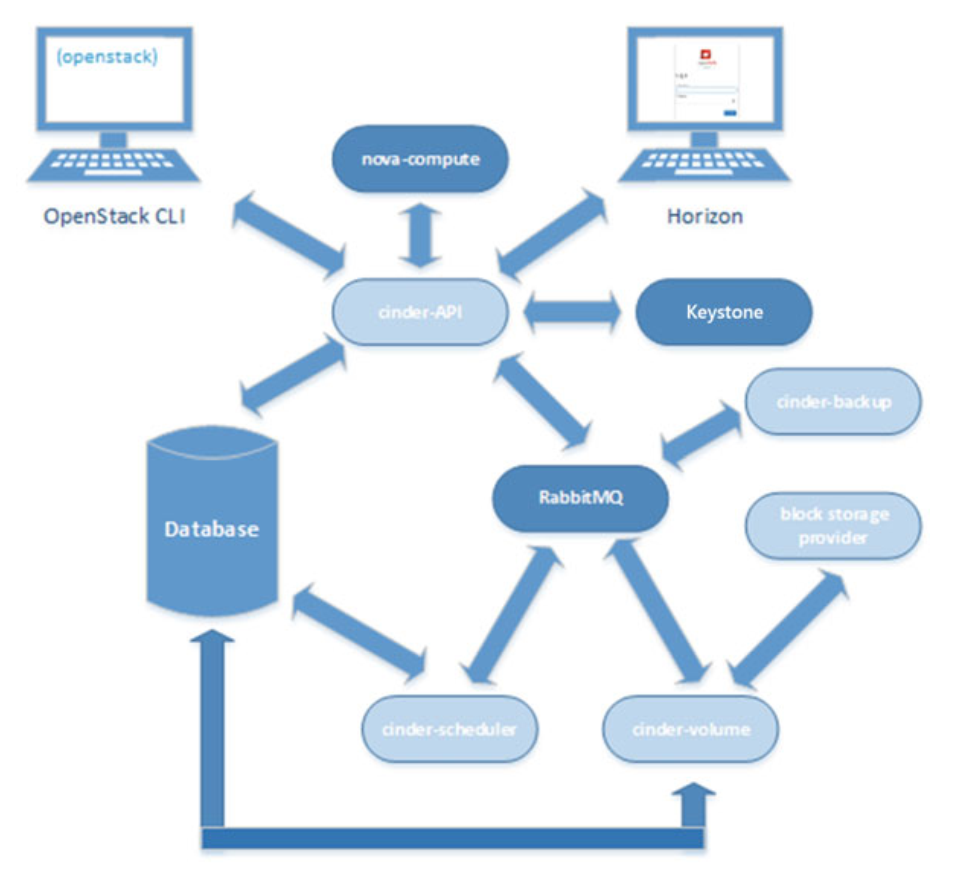

# Tổng quan về project Cinder

## 1. Giới thiệu về Cinder
- Cinder cung cấp volume cho các VM.
- Các volume sẽ không bị xóa khi xóa bỏ VM, do đó data của người dùng sẽ được lưu lại cùng với volume đó.
- Phục vụ mục đích lưu trữ dữ liệu lâu dài.

## 2. Các thành phần của cinder

  
  
- cinder-api: cung cấp các HTTP endpoint cho các API requests.
- cinder-scheduler: dịch vụ đọc các requests từ message quêu và chọn node storage phù hợp để tạo và cung cấp volume.
- cinder-volume: dịch vụ làm việc cùng với một storage back end thông qua các drivers. dịch vụ thực hiện tạo các volume.
- cinder-backup: dịch vụ backup làm việc cùng với backup back end thông qua kiến trúc driver.
