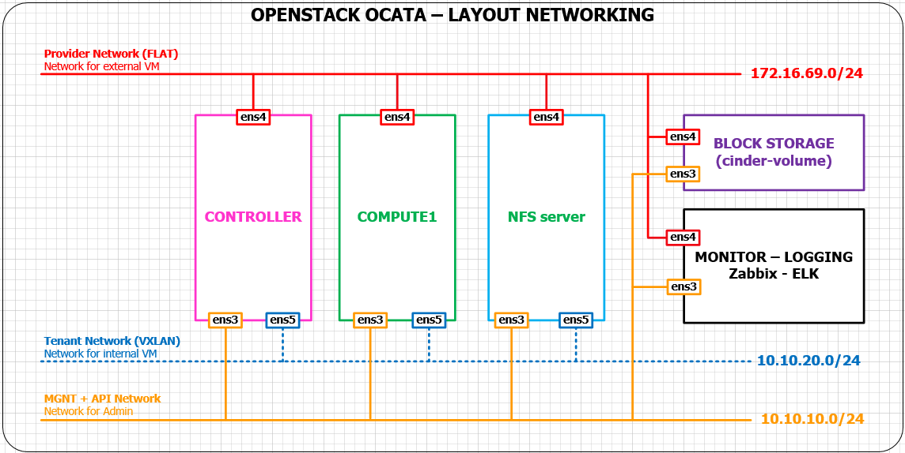

# Hướng dẫn cài đặt NFS server cho Glance và Nova
- Sau khi thực hiện cài đặt các thành phần cơ bản theo [hướng dẫn](./install.md), mình thực hiện cài thêm một node thực hiện chức năng storage tập trung cho glance và nova.

## Mô hình mạng của hệ thống

  
  
- Chúng ta sẽ thực hiện cài đặt thêm node **NFS server**
- NFS server có một số thông số như sau:
  - OS: Ubuntu server 16.04 - 64 bit
  - IP: 
    - ens3: 10.10.10.193/24
    - ens4: 172.16.69.193/24
    - ens4: 10.10.20.193/24
    
## Thực hiện cài đặt

### I. Thực hiện cài đặt trên node NFS server.
- 1. Chỉnh sửa file **/etc/hosts** có nội dung như sau:

  ```sh
  127.0.0.1       localhost
  #127.0.1.1      ubuntu

  10.10.10.190    controller
  10.10.10.191    compute1
  10.10.10.192    block1
  10.10.10.193    nfs
  
  # The following lines are desirable for IPv6 capable hosts
  ::1     localhost ip6-localhost ip6-loopback
  ff02::1 ip6-allnodes
  ff02::2 ip6-allrouters
  ```
  
- 2. Chỉnh sửa hostname thành nfs. Dùng vi sửa file **/etc/hostname** có nội dung như sau:

  ```sh
  nfs
  ```
  
- 3. Cấu hình địa chỉ IP. Dùng vi sửa file **/etc/network/interfaces**

  ```sh
  auto ens3
  iface ens3 inet static
  address 10.10.10.193
  netmask 255.255.255.0

  auto ens4
  iface ens4 inet static
  address 172.16.69.193
  netmask 255.255.255.0
  gateway 172.16.69.1
  dns-nameservers 8.8.8.8

  auto ens5
  iface ens5 inet static
  address 10.10.20.193
  netmask 255.255.255.0
  ```
  
- 4. Cập nhật và cài đặt gói phần mềm.

  ```sh
  apt-get update
  apt-get install nfs-kernel-server -y
  ```
  
- 5. Tạo thư mục để lưu trữ cho glance và nova
  - Tạo thư mục lưu image cho glance
  
    ```sh
    mkdir /nfs/glance -p
    
    chmod 777 /nfs/glance
    ```
  
  - Tạo thư mục lưu instance cho nova
  
    ```sh
    mkdir /nfs/nova/instances -p
    
    chmod 777 /nfs/nova/instances
    ```
    
- 6. Cấu hình NFS. Thêm 2 dòng cấu hình sau vào file **/etc/exports**

  ```sh
  /nfs/glance               10.10.10.0/24(rw,sync,no_root_squash,no_subtree_check)
  /nfs/nova/instances               10.10.10.0/24(rw,sync,no_root_squash,no_subtree_check)
  ```
  
- 7. Restart dịch vụ NFS

  ```sh
  service nfs-kernel-server restart
  ```
  
- 8. Reboot NFS server

  ```sh
  init 6
  ```
  
### 2. Cài đặt trên node NFS cho glance
- Cài đặt NFS cho glance, trên node controller đóng vai trò client trong mô hình lưu trữ NFS
- Thực hiện cài đặt trên node controller cho glance
- Đăng nhập vào node controller với quyền root

- 1. Thêm dòng cấu hình sau vào file **/etc/hosts**

  ```sh
  10.10.10.193    nfs
  ```
  
- 2. Cài đặt gói cho nfs

  ```sh
  apt-get update
  apt-get install nfs-common -y
  ```
  
- 3. Mount thư mục mà NFS server cung cấp cho glance để sử dụng
- Thư mục chứa image của glance là **/var/lib/glance/iamges/**
- Thực hiện mount bằng lệnh sau

  ```sh
  mount nfs:/nfs/glance /var/lib/glance/images
  ```
  
- 4. Cấu hình cho phép mount tự động khi Reboot controller, thêm dòng cấu hình sau vào file **/etc/fstab**

  ```sh
  nfs:/nfs/glance    /var/lib/glance/images   nfs auto,nofail,noatime,nolock,intr,tcp,actimeo=1800 0 0
  ```
  
- 5. Kiểm tra kết quả mount bằng lệnh sau

  ```sh
  df -h
  ```
  
  - nếu kết quả có dòng thông báo **nfs:/nfs/glance      27G  1.4G   25G   6% /var/lib/glance/images** là đã mount thành công
  
- Đến đây hệ thống đã có NFS server lưu trữ image cho glance

### II. Cài đặt NFS cho nova
- Cài đặt NFS cho nova, trên node compute1 đóng vai trò client trong mô hình lưu trữ NFS
- Thực hiện cài đặt trên node compute1 cho nova
- Đăng nhập vào node compute1 với quyền root

- 1. Thêm dòng cấu hình sau vào file **/etc/hosts**

  ```sh
  10.10.10.193    nfs
  ```
  
- 2. Cài đặt gói cho nfs

  ```sh
  apt-get update
  apt-get install nfs-common -y
  ```
  
- 3. Mount thư mục mà NFS server cung cấp cho nova để sử dụng
- Thư mục chứa instance của nova là **/var/lib/nova/instances/**
- Thực hiện mount bằng lệnh sau

  ```sh
  mount nfs:/nfs/nova/instances /var/lib/nova/instances 
  ```
  
- 4. Cấu hình cho phép mount tự động khi Reboot compute1, thêm dòng cấu hình sau vào file **/etc/fstab**

  ```sh
  nfs:/nfs/nova/instances    /var/lib/nova/instances   nfs auto,nofail,noatime,nolock,intr,tcp,actimeo=1800 0 0
  ```
  
- 5. Kiểm tra kết quả mount bằng lệnh sau

  ```sh
  df -h
  ```
  
  - nếu kết quả có dòng thông báo **nfs:/nfs/nova/instances      27G  1.4G   25G   6% /var/lib/nova/instances** là đã mount thành công


  
  
  
  
  
  
  
  
  
  
  
  
  
  
  
  
  
  
  
  
  
  
  
  
  
  
  
  
  
  
