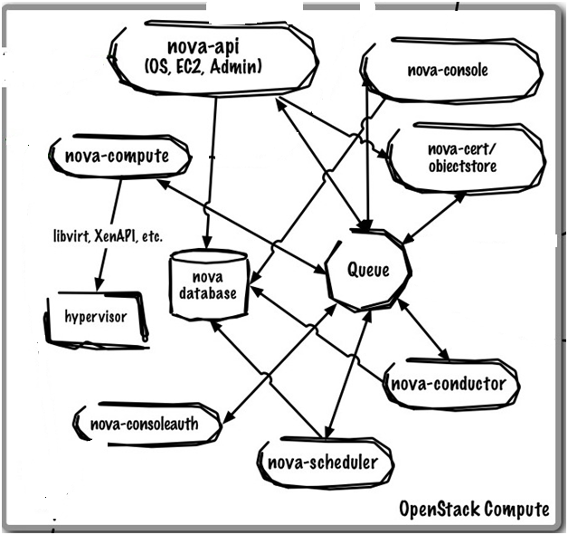

# Tổng quan về dịch vụ Compute trong Openstack (Nova)

## 1. Giới thiệu về Nova
- Nova được xem là trái tim của Openstack.
- Thực hiện chức năng quản lý cơ bản về máy ảo như tạo, xóa, tắt, bật.
- Chính khả năng cung cấp VM đến người dùng, nó quy định mô hình dịch vụ của Openstack là IaaS (Infrastructure as a Services).

## 2. Kiến trúc của Nova

  
  
- Chức năng các thành phần cơ bản của Nova:
- nova-api: Tiếp nhận và phản hồi các lời gọi API từ người dùng cuối (end user).
- nova-api-metadata: Tiếp nhận yêu cầu lấy metadata từ các instance. Dịch vụ này thường được sử dụng khi triển khai chế độ multi-host với nova-network.
- nova-compute: Một worker daemon thực hiện tác vụ quản lý vòng đời các máy ảo như: tạo và hủy các instance thông qua các hypervisor APIs. Ví dụ:
  - XenAPI đối với XenServer/XCP
  - libvirt đối với KVM hoặc QEMU
  - VMwareAPI đối với VMware
Tiến trình xử lý của nova-compute khá phức tạp, về cơ bản thì daemon này sẽ tiếp nhận các hành động từ hàng đợi và thực hiện một chuỗi các lệnh hệ thống như vận hành máy ảo KVM và cập nhật trạng thái của máy ảo đó vào cơ sở dữ liệu.
- nova-scheduler: Daemon này lấy các yêu cầu tạo máy ảo từ hàng đợi và xác định xem server compute nào sẽ được chọn để vận hành máy ảo.
- nova-conductor: Là module trung gian tương tác giữa nova-compute và cơ sở dữ liệu. Nó hủy tất cả các truy cập trự tiếp vào cơ sở dữ liệu tạo ra bởi nova-compute nhằm mục đích bảo mật, tránh trường hợp máy ảo bị xóa mà không có chủ ý của người dùng.
- nova-cert: Là một worker daemon phục vụ dịch vụ Nova Cert cho chứng chỉ X509, được sử dụng để tạo các chứng chỉ cho euca-bundle-image. Dịch vụ này chỉ cần thiết khi sử dụng EC2 API.
- nova-network: Tương tự như nova-compute, tiếp nhận yêu cầu về network từ hàng đợi và điều khiển mạng, thực hiện các tác vụ như thiết lập các giao diện bridging và thay đổi các luật của IPtables.
- nova-consoleauth: Ủy quyền tokens cho người dùng mà console proxies cung cấp. Dịch vụ này phải chạy với console proxies để làm việc.
- nova-novncproxy: Cung cấp một proxy để truy cập máy ảo đang chạy thông qua kết nối VNC. Hỗ trợ các novnc client chạy trên trình duyệt.
- nova-spicehtml5proxy: Cung cấp một proxy truy cấp máy ảo đang chạy thông qua kết nối SPICE. Hỗ trợ các client chạy trên trình duyệt hỗ trợ HTML5.
- nova-xvpvncproxy: Cung cấp một proxy truy cập máy ảo đang chạy thông qua kết nối VNC.
- nova client: Cho phép người dùng thực hiện tác vụ quản trị hoặc các tác vụ thông thường của người dùng cuối.
- The queue: Là một trung tâm chuyển giao bản tin giữa các daemon. Thông thường queue này cung cấp bởi một phần mềm message queue hỗ trợ giao thức AMQP: RabbitMQ, Zero MQ.
- SQL database: Lưu trữ hầu hết trạng thái ở thời điểm biên dịch và thời điểm chạy cho hạ tầng cloud:
  - Các loại máy ảo đang có sẵn
  - Các máy tính đang đưa vào sử dụng
  - Hệ thống mạng sẵn sàng
  - Các projects.
Về cơ bản, OpenStack Compute hỗ trợ bất kỳ hệ quản trị cơ sở dữ liệu nào như SQLite3 (cho việc kiểm tra và phát triển công việc), MySQL, PostgreSQL.