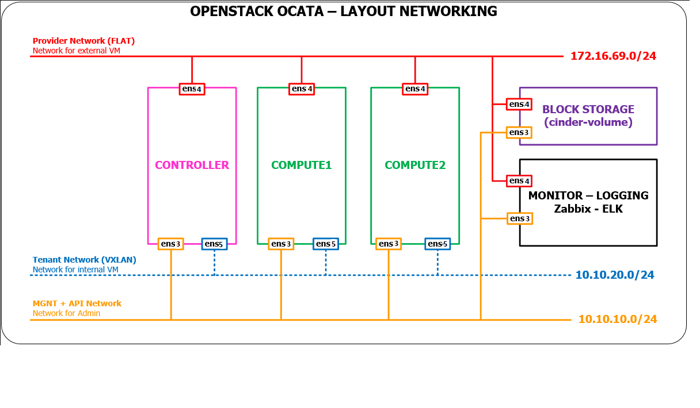
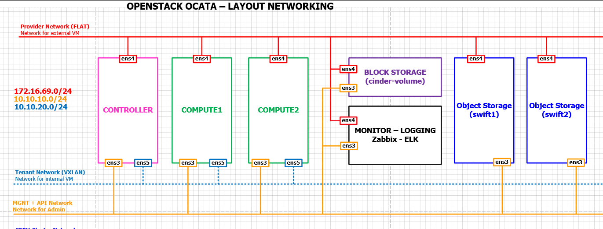

# Cài đặt Object Storage (Swift) cho openstack OCATA

## Tài liệu cài đặt thêm dịch vụ Object Storage cho openstack OCATA
- Hệ thống OCATA đã được cài đặt theo mô hình sau.

  
  
  - Tham khảo cách cài đặt [ở đây](./install.md)
  
- Thực hiện cài đặt thêm dịch vụ Object Storage theo mô hình sau

  
  
## I. Cài đặt môi trường
### 1. Cấu hình name resolution.
- Cấu hình trên node controller, compute1 và block1. Dùng vi để sửa file `/etc/hosts`. Nội dung file hosts sẽ như sau (Thực hiện trên cả 3 node).
  
  ```sh
    
  10.10.10.190    controller

  10.10.10.191    compute1

  10.10.10.192    block1

  10.10.10.193    object1

  10.10.10.194    object2
  ```
  
### 2. Cài đặt địa chỉ mạng cho 2 node object
- Cả 2 node object đều sử dụng OS là Ubuntu server 16.04 64-bit.
- Mỗi node đều có 3 ổ đĩa: 1 ổ để cài OS và 2 ổ còn lại để sử dụng cho Swift.
- Thiết lập địa chỉ mạng cho node object1. Dùng vi chỉnh sửa file `/etc/network/interfaces` với nội dung như sau.

  ```sh
  auto ens3
  iface ens3 inet static
  address 10.10.10.193
  netmask 255.255.255.0

  auto ens4
  iface ens4 inet static
  address 172.16.69.193
  netmask 255.255.255.0
  gateway 172.16.69.1
  dns-nameservers 8.8.8.8
  ```
  
- Thiết lập địa chỉ mạng cho node object2. Dùng vi chỉnh sửa file `/etc/network/interfaces` với nội dung như sau.

  ```sh
  auto ens3
  iface ens3 inet static
  address 10.10.10.194
  netmask 255.255.255.0

  auto ens4
  iface ens4 inet static
  address 172.16.69.194
  netmask 255.255.255.0
  gateway 172.16.69.1
  dns-nameservers 8.8.8.8

  ```
  
- Cấu hình name resolution cho 2 node object.

  ```sh
    
  10.10.10.190    controller

  10.10.10.191    compute1

  10.10.10.192    block1

  10.10.10.193    object1

  10.10.10.194    object2
  ```
  
- Cấu hình hostname.
- Cấu hình hostname cho node object1. Dùng vi sửa file `/etc/hostname` có nội dung như sau

  ```sh
  object1
  ```

- Cấu hình hostname cho node object2. Dùng vi sửa file `/etc/hostname` có nội dung như sau

  ```sh
  object2
  ```  
  
- Thực hiện cài đặt NTP cho cả 2 node object

  ```sh
  apt install chrony -y
  ```
  
- Cấu hình NTP. Sửa file `/etc/chrony/chrony.conf` và xóa tất cả dòng server rồi thêm dòng sau.

  ```sh
  server controller iburst
  ```
  
- Restart NTP

  ```sh
  service chrony restart
  ```
  
- Kiểm tra lại cài đặt NTP. Chạy lệnh sau trên 2 node object.

  ```sh
  ~# chronyc sources
  210 Number of sources = 1
  MS Name/IP address         Stratum Poll Reach LastRx Last sample
  ===============================================================================
  ^? controller                    0   7     0   10y     +0ns[   +0ns] +/-    0ns
  ```
  
- Cài đặt repos để cài OpenStack OCATA

- Cài đặt gói để cài OpenStack OCATA

  ```sh
  apt-get install software-properties-common -y
  add-apt-repository cloud-archive:ocata -y
  ```
  
- Cập nhật các gói phần mềm

  ```sh
  apt -y update && apt -y dist-upgrade
  ```
  
- Cài đặt các gói client của OpenStack.

  ```sh
  apt install python-openstackclient -y
  ```
  
- Khởi động lại máy chủ

  ```sh
  init 6
  ```
  
## II. Cài đặt Swift trên node controller
### 1. Tạo user swift, gán quyền và tạo endpoint API cho dịch vụ swift
- 1. Chạy script biến môi trường: `source admin-openrc`
- 2. Tạo user `swift`

  ```sh
  ~# openstack user create --domain default --password Welcome123 swift
  +---------------------+----------------------------------+
  | Field               | Value                            |
  +---------------------+----------------------------------+
  | domain_id           | default                          |
  | enabled             | True                             |
  | id                  | 85072ff8b6134ec6a19a814ec52fa2a7 |
  | name                | swift                            |
  | options             | {}                               |
  | password_expires_at | None                             |
  +---------------------+----------------------------------+
  ```
  
- 3. Thêm role admin cho user swift trên project service

  ```sh
  openstack role add --project service --user swift admin
  ```
  
  - Kiểm tra lại xem user swift có role là gì
  
  ```sh
  ~# openstack role list --user swift --project service
  Listing assignments using role list is deprecated. Use role assignment list --user <user-name> --project <project-name> --names instead.
  +----------------------------------+-------+---------+-------+
  | ID                               | Name  | Project | User  |
  +----------------------------------+-------+---------+-------+
  | ec9157c203314df69c4f3805e3fec0e7 | admin | service | swift |
  +----------------------------------+-------+---------+-------+
  ```
 
- 4. Tạo dịch vụ có tên swift

  ```sh
  ~# openstack service create --name swift --description "OpenStack Object Storage" object-store
  +-------------+----------------------------------+
  | Field       | Value                            |
  +-------------+----------------------------------+
  | description | OpenStack Object Storage         |
  | enabled     | True                             |
  | id          | 5a6c0b0cf7834cd8a0aa70d73754433b |
  | name        | swift                            |
  | type        | object-store                     |
  +-------------+----------------------------------+
  ```
  
- 5. Tạo các endpoint cho swift

  ```sh
  openstack endpoint create --region RegionOne \
  object-store public http://controller:8080/v1/AUTH_%\(tenant_id\)s
  
  openstack endpoint create --region RegionOne \
  object-store internal http://controller:8080/v1/AUTH_%\(tenant_id\)s

  openstack endpoint create --region RegionOne \
  object-store admin http://controller:8080/v1
  ```
  
### 2. Cài đặt và cấu hình cho dịch vụ Swift
- 1. Cài đặt gói swift

  ```sh
  apt-get install -y swift swift-proxy python-swiftclient \
  python-keystoneclient python-keystonemiddleware \
  memcached
  ```
  
- 2. Tạo thư mục `/etc/swift`

  ```sh
  mkdir /etc/swift
  ```
  
- 3. Lấy file cấu hình dịch vụ proxy từ kho lưu trữ Object storage.

  ```sh
  curl -o /etc/swift/proxy-server.conf https://git.openstack.org/cgit/openstack/swift/plain/etc/proxy-server.conf-sample?h=stable/newton
  ```
  
- 4. Sửa file `/etc/swift/proxy-server.conf`.
- Trong section [DEFAULT], cấu hình bind port, user, and cấu hình thư mục

  ```sh
  [DEFAULT]
  ...
  bind_port = 8080
  user = swift
  swift_dir = /etc/swift
  ```
  
- Trong `[pipeline:main]` section, xóa 2 modules là `tempurl` và `tempauth`, thêm 2 modules là `authtoken` và `keystoneauth`.

  ```sh
  [pipeline:main]
  pipeline = catch_errors gatekeeper healthcheck proxy-logging cache container_sync bulk ratelimit authtoken keystoneauth container-quotas account-quotas slo dlo versioned_writes proxy-logging proxy-server
  ```
  
  - chú ý không thay đổi thứ tự các modules.
  
- Trong `[app:proxy-server]` section, cho phép tự động tạo tài khoản.

  ```sh
  [app:proxy-server]
  use = egg:swift#proxy
  ...
  account_autocreate = True
  ```
  
- Trong `[filter:keystoneauth]` section, cấu hình các roles của operator.

  ```sh
  [filter:keystoneauth]
  use = egg:swift#keystoneauth
  ...
  operator_roles = admin,user
  ```
  
- Trong `[filter:authtoken]` section, cấu hình truy cập dịch vụ identity

  ```sh
  [filter:authtoken]
  paste.filter_factory = keystonemiddleware.auth_token:filter_factory
  ...
  auth_uri = http://controller:5000
  auth_url = http://controller:35357
  memcached_servers = controller:11211
  auth_type = password
  project_domain_name = default
  user_domain_name = default
  project_name = service
  username = swift
  password = Welcome123
  delay_auth_decision = True
  ```
  
- Trong `[filter:cache]` section, cấu hình vị trí memcached.

  ```sh
  [filter:cache]
  use = egg:swift#memcache
  ...
  memcache_servers = controller:11211
  ```
  
## III. Cài đặt và cấu hình trên 2 node Object.
- Trên mỗi node object đều có 3 ổ đĩa. Kiểm tra bằng lệnh sau

  ```sh
  ~# lsblk
  NAME                  MAJ:MIN RM  SIZE RO TYPE MOUNTPOINT
  sr0                    11:0    1  829M  0 rom
  vda                   253:0    0   20G  0 disk
  ├─vda1                253:1    0  487M  0 part /boot
  ├─vda2                253:2    0    1K  0 part
  └─vda5                253:5    0 19.5G  0 part
    ├─ubuntu--vg-root   252:0    0 18.5G  0 lvm  /
    └─ubuntu--vg-swap_1 252:1    0    1G  0 lvm  [SWAP]
  vdb                   253:16   0   15G  0 disk
  vdc                   253:32   0   15G  0 disk
  ```
  
  - Cả 2 node trên hệ thống làm hướng dẫn đều có kết quả như trên.
  - ổ `vda` dùng để cài OS
  - 2 ổ `vdb` và `vdc` để sử dụng cho Swift.
  
- Thực hiện cài đặt trên cả 2 node các bước sau.
### 1. Cài đặt các gói hỗ trợ.
- 1. Cài đặt các gói hỗ trợ.

  ```sh
  apt-get install xfsprogs rsync -y
  ```

- 2. Định dạng `/dev/vdb` và `/dev/vdc` theo XFS

  ```sh
  mkfs.xfs /dev/vdb
  mkfs.xfs /dev/vdc
  ```
  
- 3. Tạo thư mục để mount.

  ```sh
  mkdir -p /srv/node/vdb
  mkdir -p /srv/node/vdc
  ```

- 4. Sửa file `/etc/fstab`, thêm các dòng sau.

  ```sh
  /dev/vdb /srv/node/vdb xfs noatime,nodiratime,nobarrier,logbufs=8 0 2
  /dev/vdc /srv/node/vdc xfs noatime,nodiratime,nobarrier,logbufs=8 0 2
  ```
  
- 5. Mount

  ```sh
  mount /srv/node/vdc
  mount /srv/node/vdc
  ```
  
- 6. Tạo file mới có tên là `/etc/rsyncd.conf` với nội dung sau

  ```sh
  uid = swift
  gid = swift
  log file = /var/log/rsyncd.log
  pid file = /var/run/rsyncd.pid
  address = MANAGEMENT_INTERFACE_IP_ADDRESS

  [account]
  max connections = 2
  path = /srv/node/
  read only = False
  lock file = /var/lock/account.lock

  [container]
  max connections = 2
  path = /srv/node/
  read only = False
  lock file = /var/lock/container.lock

  [object]
  max connections = 2
  path = /srv/node/
  read only = False
  lock file = /var/lock/object.lock
  ```
  
  - Trên node Object1 thì thay MANAGEMENT_INTERFACE_IP_ADDRESS bằng địa chỉ `10.10.10.193`
  - Trên node Object2 thì thay MANAGEMENT_INTERFACE_IP_ADDRESS bằng địa chỉ `10.10.10.194`
  
- 7. Sửa file `/etc/default/rsync` và bật dịch vụ `rsync`.

  ```sh
  RSYNC_ENABLE=true
  ```
  
- 8. Bật dịch vụ `rsync `

  ```sh
  service rsync start
  ```
  
### 2. Cài đặt và cấu hình các thành phần
- 1. Cài đặt các gói

  ```sh
  apt-get install swift swift-account swift-container swift-object -y
  ```
  
- 2. Lấy files cấu hình accounting, container, object service từ kho Object storage.

  ```sh
  curl -o /etc/swift/account-server.conf https://git.openstack.org/cgit/openstack/swift/plain/etc/account-server.conf-sample?h=stable/newton
  curl -o /etc/swift/container-server.conf https://git.openstack.org/cgit/openstack/swift/plain/etc/container-server.conf-sample?h=stable/newton
  curl -o /etc/swift/object-server.conf https://git.openstack.org/cgit/openstack/swift/plain/etc/object-server.conf-sample?h=stable/newton
  ```
  
- 3. Sửa file `/etc/swift/account-server.conf`.
- Trong `[DEFAULT]` section, cấu hình địa chỉ `bind IP`, `bind port`, `user`, cấu hình directory, và mount point directory:

  ```sh
  [DEFAULT]
  #...
  bind_ip = MANAGEMENT_INTERFACE_IP_ADDRESS
  bind_port = 6202
  user = swift
  swift_dir = /etc/swift
  devices = /srv/node
  mount_check = True
  ```

  - Trên node Object1 thì thay MANAGEMENT_INTERFACE_IP_ADDRESS bằng địa chỉ `10.10.10.193`
  - Trên node Object2 thì thay MANAGEMENT_INTERFACE_IP_ADDRESS bằng địa chỉ `10.10.10.194`
  
- Trong `[pipeline:main]` section, enable các modules phù hợp

  ```sh
  [pipeline:main]
  pipeline = healthcheck recon account-server
  ```
  
- Trong `[filter:recon]` section, cấu hình như sau:

  ```sh
  [filter:recon]
  use = egg:swift#recon
  #...
  recon_cache_path = /var/cache/swift
  ```

- 4. Sửa file `/etc/swift/container-server.conf`.
- Trong `[DEFAULT]` section, cấu hình `bind IP address`, `bind port`, `user`, cấu hình directory, và mount point directory:

  ```sh
  [DEFAULT]
  # ...
  bind_ip = MANAGEMENT_INTERFACE_IP_ADDRESS
  bind_port = 6201
  user = swift
  swift_dir = /etc/swift
  devices = /srv/node
  mount_check = True
  ```

  - Trên node Object1 thì thay MANAGEMENT_INTERFACE_IP_ADDRESS bằng địa chỉ `10.10.10.193`
  - Trên node Object2 thì thay MANAGEMENT_INTERFACE_IP_ADDRESS bằng địa chỉ `10.10.10.194`

- Trong `[pipeline:main]` section, enable các modules phù hợp:

  ```sh
  [pipeline:main]
  pipeline = healthcheck recon container-server
  ```
  
- Trong `[filter:recon]` section, cấu hình như sau:

  ```sh
  [filter:recon]
  use = egg:swift#recon
  #...
  recon_cache_path = /var/cache/swift
  ```
  
- 5. Sửa file `/etc/swift/object-server.conf`
- Trong `[DEFAULT]` section, cấu hình `bind IP address`, `bind port`, `user`, cấu hình directory, và mount point directory:

  ```sh
  [DEFAULT]
  # ...
  bind_ip = MANAGEMENT_INTERFACE_IP_ADDRESS
  bind_port = 6200
  user = swift
  swift_dir = /etc/swift
  devices = /srv/node
  mount_check = True
  ```

  - Trên node Object1 thì thay MANAGEMENT_INTERFACE_IP_ADDRESS bằng địa chỉ `10.10.10.193`
  - Trên node Object2 thì thay MANAGEMENT_INTERFACE_IP_ADDRESS bằng địa chỉ `10.10.10.194`

- Trong `[pipeline:main]` section, enable các modules phù hợp:

  ```sh
  [pipeline:main]
  pipeline = healthcheck recon object-server
  ```
  
- Trong `[filter:recon]` section, cấu hình như sau:

  ```sh
  [filter:recon]
  use = egg:swift#recon
  #...
  recon_cache_path = /var/cache/swift
  recon_lock_path = /var/lock
  ```
 
- 7. Phân quyền thư mục

  ```sh
  chown -R swift:swift /srv/node
  ```
  
- 8. Tạo thư mục `recon` và phân quyền cho nó

  ```sh
  mkdir -p /var/cache/swift
  chown -R root:swift /var/cache/swift
  chmod -R 775 /var/cache/swift
  ```
  
## IV. Tạo và phân phối các rings ban đầu.
- Bước này thực hiện trên node controller
### 1. Tạo tài khoản ring
- 1. đến thư mục `/etc/swift`

  ```sh
  cd /etc/swift
  ```
  
- 2. Tạo file `account.builder`

  ```sh
  swift-ring-builder account.builder create 10 3 1
  ```
  
- 3. Thêm mỗi node đến ring

  ```sh
  swift-ring-builder account.builder add \
  --region 1 --zone 1 --ip 10.10.10.193 --port 6202 --device vdb --weight 15
  
  swift-ring-builder account.builder add \
  --region 1 --zone 1 --ip 10.10.10.193 --port 6202 --device vdc --weight 15
  
  swift-ring-builder account.builder add \
  --region 1 --zone 1 --ip 10.10.10.194 --port 6202 --device vdb --weight 15
  
  swift-ring-builder account.builder add \
  --region 1 --zone 1 --ip 10.10.10.194 --port 6202 --device vdc --weight 15
  ```
  
- 4. Kiểm tra lại nội dung của ring

  ```sh
  /etc/swift# swift-ring-builder account.builder
  account.builder, build version 4
  1024 partitions, 3.000000 replicas, 1 regions, 1 zones, 4 devices, 100.00 balance, 0.00 dispersion
  The minimum number of hours before a partition can be reassigned is 1 (0:00:00 remaining)
  The overload factor is 0.00% (0.000000)
  Ring file account.ring.gz not found, probably it hasn't been written yet
  Devices:   id region zone   ip address:port replication ip:port  name weight partitions balance flags meta
              0      1    1 10.10.10.193:6202   10.10.10.193:6202   vdb  15.00          0 -100.00
              1      1    1 10.10.10.193:6202   10.10.10.193:6202   vdc  15.00          0 -100.00
              2      1    1 10.10.10.194:6202   10.10.10.194:6202   vdc  15.00          0 -100.00
              3      1    1 10.10.10.194:6202   10.10.10.194:6202   vdb  15.00          0 -100.00
  ```
  
- 5. Tái cân bằng ring

  ```sh
  /etc/swift# swift-ring-builder account.builder rebalance
  Reassigned 3072 (300.00%) partitions. Balance is now 0.00.  Dispersion is now 0.00
  ```
  
### 2. Tạo container ring
- 1. đến thư mục `/etc/swift`

  ```sh
  cd /etc/swift
  ```
  
- 2. tạo file `container.builder`

  ```sh
  swift-ring-builder container.builder create 10 3 1
  ```
  
- 3. thêm mỗi node đến ring

  ```sh
  swift-ring-builder container.builder add \
  --region 1 --zone 1 --ip 10.10.10.193 --port 6201 --device vdb --weight 15

  swift-ring-builder container.builder add \
  --region 1 --zone 1 --ip 10.10.10.193 --port 6201 --device vdc --weight 15

  swift-ring-builder container.builder add \
  --region 1 --zone 1 --ip 10.10.10.194 --port 6201 --device vdb --weight 15

  swift-ring-builder container.builder add \
  --region 1 --zone 1 --ip 10.10.10.194 --port 6201 --device vdc --weight 15

- 4. Kiểm tra lại nội dung của ring

  ```sh
  /etc/swift# swift-ring-builder container.builder
  container.builder, build version 4
  1024 partitions, 3.000000 replicas, 1 regions, 1 zones, 4 devices, 100.00 balance, 0.00 dispersion
  The minimum number of hours before a partition can be reassigned is 1 (0:00:00 remaining)
  The overload factor is 0.00% (0.000000)
  Ring file container.ring.gz not found, probably it hasn't been written yet
  Devices:   id region zone   ip address:port replication ip:port  name weight partitions balance flags meta
              0      1    1 10.10.10.193:6201   10.10.10.193:6201   vdb  15.00          0 -100.00
              1      1    1 10.10.10.193:6201   10.10.10.193:6201   vdc  15.00          0 -100.00
              2      1    1 10.10.10.194:6201   10.10.10.194:6201   vdb  15.00          0 -100.00
              3      1    1 10.10.10.194:6201   10.10.10.194:6201   vdc  15.00          0 -100.00
  ```
  
- 5. Tái cân bằng ring

  ```sh
  /etc/swift# swift-ring-builder container.builder rebalance
  Reassigned 3072 (300.00%) partitions. Balance is now 0.00.  Dispersion is now 0.00
  ```
  
### 3. Tạo object ring
- 1. đến thư mục `/etc/swift`

  ```sh
  cd /etc/swift
  ```
  
- 2. Tạo file `object.builder`

  ```sh
  swift-ring-builder object.builder create 10 3 1
  ```
  
- 3. thêm mỗi node đến ring

  ```sh
  swift-ring-builder object.builder add \
  --region 1 --zone 1 --ip 10.10.10.193 --port 6200 --device vdb --weight 15
  
  swift-ring-builder object.builder add \
  --region 1 --zone 1 --ip 10.10.10.193 --port 6200 --device vdc --weight 15
  
  swift-ring-builder object.builder add \
  --region 1 --zone 1 --ip 10.10.10.194 --port 6200 --device vdb --weight 15
  
  swift-ring-builder object.builder add \
  --region 1 --zone 1 --ip 10.10.10.194 --port 6200 --device vdc --weight 15
  ```

- 4. Kiểm tra lại nội dung của ring

  ```sh
  /etc/swift# swift-ring-builder object.builder
  object.builder, build version 4
  1024 partitions, 3.000000 replicas, 1 regions, 1 zones, 4 devices, 100.00 balance, 0.00 dispersion
  The minimum number of hours before a partition can be reassigned is 1 (0:00:00 remaining)
  The overload factor is 0.00% (0.000000)
  Ring file object.ring.gz not found, probably it hasn't been written yet
  Devices:   id region zone   ip address:port replication ip:port  name weight partitions balance flags meta
              0      1    1 10.10.10.193:6200   10.10.10.193:6200   vdb  15.00          0 -100.00
              1      1    1 10.10.10.193:6200   10.10.10.193:6200   vdc  15.00          0 -100.00
              2      1    1 10.10.10.194:6200   10.10.10.194:6200   vdb  15.00          0 -100.00
              3      1    1 10.10.10.194:6200   10.10.10.194:6200   vdc  15.00          0 -100.00
  ```
  
- 5. Tái cân bằng ring

  ```sh
  /etc/swift# swift-ring-builder object.builder rebalance
  Reassigned 3072 (300.00%) partitions. Balance is now 0.00.  Dispersion is now 0.00
  ```
  
### 4. Copy các file `account.ring.gz, container.ring.gz, and object.ring.gz` đến thư mục `/etc/swift` trên mỗi node object storage
- Sử dụng lệnh scp để đẩy các file này đến mỗi node Object storage

  ```sh
  scp /etc/swift/account.ring.gz /etc/swift/container.ring.gz /etc/swift/object.ring.gz root@172.16.69.193:/etc/swift
  scp /etc/swift/account.ring.gz /etc/swift/container.ring.gz /etc/swift/object.ring.gz root@172.16.69.194:/etc/swift
  ```

## V. Hoàn thành cài đặt
- Thực hiện trên node controller
- 1. Lấy file `/etc/swift/swift.conf` từ kho lưu trữ Object storage

  ```sh
  curl -o /etc/swift/swift.conf \
  https://git.openstack.org/cgit/openstack/swift/plain/etc/swift.conf-sample?h=stable/newton
  ```
  
- 2. Sửa file `/etc/swift/swift.conf`
- Trong `[swift-hash]` section.

  ```sh
  [swift-hash]
  ...
  swift_hash_path_suffix = HASH_PATH_SUFFIX
  swift_hash_path_prefix = HASH_PATH_PREFIX
  ```
  
  - Thay HASH_PATH_PREFIX and HASH_PATH_SUFFIX với giá trị duy nhất.
  
- Trong `[storage-policy:0]` section, cấu hình chính sách storage mặc định

  ```sh
  [storage-policy:0]
  ...
  name = Policy-0
  default = yes
  ```
  
- 3. copy file `swift.conf` đến thư mục `/etc/swift` trên tất cả các node Object storage

  ```sh
  scp /etc/swift/swift.conf root@172.16.69.193:/etc/swift/
  
  scp /etc/swift/swift.conf root@172.16.69.194:/etc/swift/
  ```
  
- 4. Thực hiện lệnh sau trên các node controller và 2 node Object storage

  ```sh
  chown -R root:swift /etc/swift
  ```
  
- 5. Restart các dịch vụ trên controller

  ```sh
  service memcached restart
  service swift-proxy restart
  ```
  
#### Start dịch vụ Object storage
- thực hiện trên node Object storage

  ```sh
  swift-init all start
  ```
  
## Kiểm tra lại các bước cài đặt
- Khai cáo cridentials cho user demo:

  ```sh
  source demo-openrc
  ```
  
- Xem trạng thái dịch vụ

  ```sh
  ~# swift stat
                 Account: AUTH_b54646bf669746db8c62ec0410bd0528
              Containers: 0
                 Objects: 0
                   Bytes: 0
         X-Put-Timestamp: 1502470995.64351
             X-Timestamp: 1502470995.64351
              X-Trans-Id: txa09f5c3dd9494bf6aa0a3-00598de350
            Content-Type: text/plain; charset=utf-8
  X-Openstack-Request-Id: txa09f5c3dd9494bf6aa0a3-00598de350
  ```
  
- Tạo `container1` container

  ```sh
  ~# openstack container create container1
  +--------------------------------+------------+--------------------------------+
  | account                        | container  | x-trans-id                     |
  +--------------------------------+------------+--------------------------------+
  | AUTH_b54646bf669746db8c62ec041 | container1 | tx38e4667d3e6b49a087cc5-00598d |
  | 0bd0528                        |            | f2ec                           |
  +--------------------------------+------------+--------------------------------+
  ```
  
- upload `file1` để test

  ```sh
  root@controller:~# touch file1
    
  root@controller:~# openstack object create container1 file1
  +--------+------------+----------------------------------+
  | object | container  | etag                             |
  +--------+------------+----------------------------------+
  | file1  | container1 | d41d8cd98f00b204e9800998ecf8427e |
  +--------+------------+----------------------------------+
  ```
  
- List các file trong container1

  ```sh
  ~# openstack object list container1
  +-------+
  | Name  |
  +-------+
  | file1 |
  +-------+
  ```
  
  


  
  
  
  
  
  