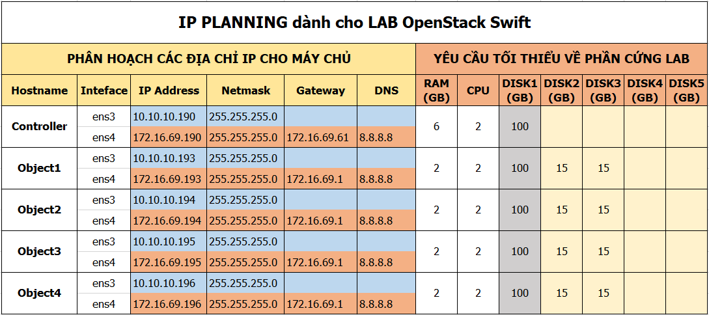

## Bài 2. Mở rộng hệ thống
- Bài toán đặt ra: với hệ thống lưu trữ ban đầu sau một thời gian sử dụng, hệ thống đã đầy hoặc có nhu cầu mở rộng thêm các node lưu trữ.
- Có 2 yêu cầu: 
	- 1. Thêm các node lưu trữ mới và dữ liệu được lưu trên cả các node cũ và các node mới.
	- 2. Toàn bộ dữ liệu mới sẽ được lưu trên các node mới.
	
---
- Mô hình hệ thống như sau:

	
	
- Ip planning

	
	
- 2 node `object1` và `object2` là hệ thống cũ, thêm 2 node mới `object3` và `object4`
	
## Yêu cầu thứ nhất: mở rộng và cho phép lưu trữ trên toàn bộ hệ thống.
- Với 2 node `object3` và `object4` thực hiện các bước cài đặt tương tự như `object1` và `object2`. Tham khảo cài đặt [tại đây](https://github.com/pxduc96/thuctap012017/blob/master/DucPX/Install_PIKE/Pike.md#m)

- 